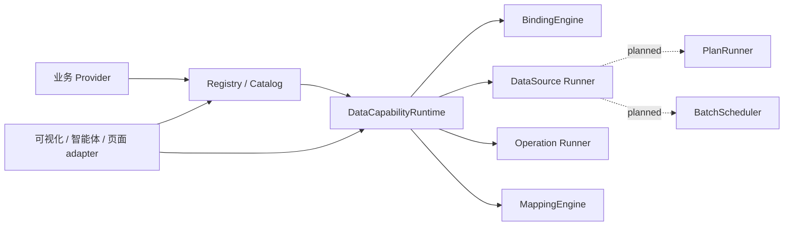

# 数据能力注册中心设计

## 1. 文档定位与维护状态

- owning module：`jetlinks-web-core`。
- 设计范围：前端通用数据能力的注册、发现、绑定、执行和生命周期治理。
- 首个验证消费者：`modules/visualization-manager-ui`，但 core 不依赖可视化、智能体或具体业务类型。
- 兼容边界：已经保存、发布或作为模板流转的可视化项目 `bindCommands`。
- 当前阶段：模块接口注册与基础查询/映射闭环已实现；高级编排、format/coerce、合并和 Operation 策略仍需按本文路线补齐。
- 当前 Pull Request：[#92](https://github.com/jetlinks-v2/jetlinks-web-core/pull/92)。
- 最近实现审计：2026-07-27，当前为待用户审查的本地改动，尚未 commit/push/merge。

当前实现事实只取自以下位置：

| 事实 | 代码入口 |
| --- | --- |
| 公共类型 | `src/data-capability/types.ts` |
| 公共 Registry 门面 | `src/data-capability/registry.ts` |
| Registry、Runtime、Provider manifest/生命周期 | `src/data-capability/internal/provider-registry.ts`、`provider-manifest.ts`、`runtime.ts` |
| DataSource、Operation 执行与资源释放 | `src/data-capability/internal/source-runner.ts`、`src/data-capability/internal/operation-runner.ts`、`src/data-capability/internal/resource-lifecycle.ts` |
| 结构化绑定 | `src/data-capability/binding.ts` |
| Schema 校验 | `src/data-capability/validation.ts` |
| 输出投影、目标 Schema 和公共工具 | `src/data-capability/mapping.ts`、`src/data-capability/utils.ts` |
| 简化 Query 门面 | `src/data-capability/client.ts` |
| 旧命令适配 | `src/data-capability/legacy-command.ts` |
| 模块动态资源 | `src/types/module.ts`、`src/utils/module-registry.ts` |
| 行为测试 | `tests/unit/dataCapabilityCore.spec.ts`、`tests/unit/dataCapabilitySchema.spec.ts`、`tests/unit/dataCapabilityLegacy.spec.ts`、`tests/unit/dataCapabilityModuleRegistry.spec.ts` |

本文使用三种实现状态：

- **已实现**：运行时存在对应行为，并有源码或行为测试证据。
- **部分实现**：类型或局部行为已存在，但完整运行链路尚未闭环。
- **未实现**：只有设计或类型占位，当前 Runtime 会拒绝或忽略该能力。

类型中出现某个字段不代表运行时已经支持。尤其是 `poll`、`retry`、`reconnect`、`DataSourcePlan`、Provider 合并以及 Operation 高级策略，必须以第 8 节实现矩阵为准。

### 1.1 文档维护规则

1. 本文是该能力的唯一长期设计入口，不再新增平行的“补充设计”“评审修复记录”或阶段流水文档。
2. 一个概念只保留一个权威章节；其他位置使用引用，不复制完整接口和解释。
3. 公共签名以 `types.ts` 为事实源，本文只保留必要的稳定模型和语义，不维护第二份完整源码。
4. 公共类型、持久化结构、生命周期或执行语义变化时，同一 PR 必须更新第 8 节实现矩阵、兼容影响和验证证据。
5. 评审过程、一次性命令输出、已完成 TODO 和 commit 列表保留在 Git/PR，不进入长期正文。
6. 每类核心模型最多保留一个最小示例；消费者专属 UI 和迁移细节放在对应 adapter 文档或测试中。
7. 实现矩阵记录审计 commit。该 commit 之后发生公共能力变更时，必须重新核对，不能默认本文仍然准确。

### 1.2 PR #92 必要优化实施计划

目标：在 PR #92 的现有数据能力中心基础上补齐可交付的模块接口注册与调用闭环。业务模块声明自己暴露的 capability，调用方只提供 capability ID、参数、目标 Schema 和可选映射，即可通过统一 Client 执行；持久化绑定仍使用固定版本契约。

- owning module：`jetlinks-web-core/src/data-capability/`；模块资源类型同步调整 `src/types/module.ts` 和 `src/utils/module-registry.ts`。
- 首个真实消费者：`modules/visualization-manager-ui` 只调整 `dataCapabilityProviders` manifest，不改业务接口、页面、菜单或既有项目数据。
- 不实现任意 JavaScript、CEL、类型强转、format、PlanRunner、参数自动重连或后端权限替代；未支持的 mapping 类型必须结构化失败，不能静默产生 `undefined`。
- 实施顺序：先收敛 mapping/target Schema 与版本门禁，再建立 capability ID 到 Provider loader 的强类型 manifest 和精确加载，随后补注册冲突/owner/命名空间治理、模块卸载，最后提供由 Client 管理 Runtime 的简化 query 门面。
- 关键风险：manifest 声明与 Provider 实际 definitions 不一致、重复 capability ID、慢 Provider 阻塞其他模块、卸载后残留连接或未派发 Operation。上述情况分别通过加载后契约校验、默认冲突失败、独立超时与按 capability 加载、mount 生命周期清理控制。
- 验证：覆盖参数传递、对象与数组映射、目标 Schema、未知版本、Provider 失败/超时隔离、重复 ID、owner/manifest 不一致、模块卸载和两个独立 Provider；执行 `pnpm test:data-capability`、`pnpm typecheck:data-capability` 与 `git diff --check`。按工作区性能约束，本轮不默认执行全量构建。

本节用于承载本轮实现范围；完成后只在本节和第 8 节回填真实结果，不新增平行任务文档。

实施结果：上述必要优化已在本地完成，新增 `mapping.ts`、`client.ts`、`internal/provider-manifest.ts` 和版本门禁；首个真实消费者已改用强类型 manifest。当前改动只供用户审查，未 commit、push 或 merge。

验证结果：`test:data-capability` 全部通过，覆盖精确加载、超时隔离、契约冲突、owner/manifest 对账、模块卸载、版本拒绝、对象/数组映射、目标 Schema 和 Client；capability 源码、六份行为测试及类型负例的 `vue-tsc` 检查通过，`git diff --check` 通过。标准 `typecheck:data-capability` 脚本在当前 node_modules 缺少 `@types/node` 顶层链接时会先报 `TS2688`，已使用现有 `.pnpm/@types+node@24.3.0` type root 完成等价检查；按工作区性能约束未执行全量或模块构建。

### 1.3 用户选择目录实施计划

目标：在完整技术目录之外提供面向业务配置界面的稳定选择结果。调用方只消费 capability ID、名称、版本、可用状态、展示元数据和参数/结果契约，不接触 Provider loader、manifest key、运行函数或原始加载异常。

- owning module：公共契约与投影落在 `src/data-capability/`，首个消费验证点落在现有 `src/views/data-capability/lab/`；不改变页面壳层。
- 用户可选择的模块接口仅包括 `data-source` 和 `operation`。`context-value`、`value-editor`、`option-source` 仍是绑定和配置阶段的技术扩展，通过 `resolveCatalog()` 提供给开发工具，不重复包装成业务接口选项。
- 本轮新增 `resolveCapabilityChoices()`，返回 `items + partial + diagnostics`。选择项不暴露 definition、`create()`、组件 loader 或 availability resolver；DataSource 只投影 modes/config/params/result Schema，Operation 只投影 action/config/params/result Schema 与 policy。
- Provider 加载失败、超时或声明冲突时保留健康选择项并标记 `partial`；diagnostics 只返回稳定错误码、受影响 capability ID 和可重试标记，不返回 token、manifest key、异常 cause 或 loader 信息。
- 选择目录只执行 Provider readiness、definition 发现及 availability 判断，不创建 DataSource/Operation，也不执行真实 `query()` 或副作用操作。`configure` 或 `execute` 不可用的接口仍可按 discover 规则出现，但必须禁用并给出原因。
- 选择后持久化仍只保存 `{ capabilityId, version }`；label、description、metadata 和 contract 都是可重新解析的展示数据，不进入稳定引用。
- 实施顺序：先补公共类型，再补 Registry 诊断与选择投影，随后让 `/data-capability/lab` 的单个选择控件消费结果，最后补多 capability Provider、失败/超时隔离、禁用逻辑、模块卸载和零业务查询测试。
- 验证：执行 `pnpm test:data-capability`、数据能力专项类型检查及两个相关子仓的 `git diff --check`；按工作区性能约束不执行全量构建。

实施结果：已新增公共 `CapabilityChoice`/`CapabilityChoiceResult`/脱敏 diagnostics 契约、`resolveCapabilityChoices()` 与独立选择投影；现有 lab 增加单个“可调用接口”选择控件和结果查看页签。完整技术 catalog 保持不变，选择结果不包含 definition、`create()`、loader、manifest key、Provider token 或原始异常。

验证结果：`pnpm test:data-capability` 通过，覆盖一个 Provider 多 capability、加载失败/超时/冲突的健康子集、configure/execute 禁用、模块卸载、稳定持久化引用和目录解析零 `create/query`；使用现有 pnpm `@types/node@24.3.0` type root 的数据能力专项 `vue-tsc` 通过，core 与首个消费者子仓 `git diff --check` 均通过。lab 的 Vue 文件 274 行、hook 210 行；按工作区性能约束未执行全量构建。

### 1.4 版本字段命名收敛计划

目标：公共数据能力契约恢复使用对象内语义就近的 `version`，不再通过带语义前缀的字段名区分所属对象；同时保留本轮已经确认的去重结果，不给 `mapping`、`plan` 等绑定子结构重复增加版本字段。

- owning module：`jetlinks-web-core/src/data-capability/`；同步调整本模块测试、Lab 示例和首个消费者 `modules/visualization-manager-ui`。
- 最终持久化结构只保留必要的两级版本：`binding.version` 表示整份绑定结构版本，`binding.source.version` / `binding.operation.version` 表示所引用能力的契约版本。
- `query`、`mapping`、`plan` 及可视化扩展的 `refresh`、`fallback`、`presentation` 不单独声明 `version`。
- 本轮不增加旧字段兼容别名；这些命名尚处于同一批未发布本地改动中，类型、调用方、测试和文档直接收敛到唯一结构。
- 验证：执行 `pnpm test:data-capability`、版本字段残留检查和相关子仓 `git diff --check`；按工作区性能约束不执行全量构建。

实施结果：公共类型、Client、Runtime、CapabilityChoice、OptionSource、Lab、测试和可视化消费者已统一恢复 `version`。`OutputMapping` 与 `DataSourcePlan` 的独立版本字段保持删除，不增加旧字段别名；`jetlinks-web-core` 继续独立位于 `codex/data-capability-registry-design`。

验证结果：`pnpm test:data-capability` 通过；标准 `pnpm typecheck:data-capability` 仍因工作区缺少顶层 `@types/node` 链接报 `TS2688`，使用现有 pnpm `@types/node@24.3.0` type root 的等价专项 `vue-tsc` 通过；core 与可视化消费者 `git diff --check` 通过。按工作区性能约束未执行全量构建。

## 2. 目标与边界

### 2.1 要解决的问题

过去可视化主要通过服务命令目录发现和执行数据能力，导致编辑器逐渐知道设备服务 ID、命令 ID、业务接口和订阅细节。类似问题也会出现在智能体或其他页面：每个消费者都重复实现能力发现、参数选择、请求执行、流式订阅、取消和副作用控制。

通用数据能力层需要把这些共性收敛到稳定边界：

- 业务模块主动暴露自己拥有的数据源和操作；
- 消费者从统一目录发现能力，不感知业务接口细节；
- 一次查询、分页、轮询和无界流使用一致的运行协议；
- 固定值、参数、上下文和上游输出使用结构化绑定；
- 结果转换使用可持久化、可校验的规则，而不是任意脚本；
- 查询共享、Provider 批处理和结果组合具有不同且明确的责任；
- 创建、修改、删除和设备控制等副作用不伪装成普通数据查询。

### 2.2 核心目标

1. 在 `jetlinks-web-core` 提供业务中性的 `DataCapabilityRegistry` 和 `DataCapabilityRuntime`。
2. 支持 Provider 运行时注册、注销、覆盖、懒加载和模块动态对账。
3. 使用 RxJS `Observable` 统一有界与无界数据运行协议。
4. 使用 `DataSource` 表达读取能力，使用 `Operation` 表达副作用能力。
5. 通过 Schema、OptionSource、ValueBinding 和可选 lazy editor 支撑统一配置。
6. 让 Provider 定义业务合并语义，让 Runtime 负责调度、共享、取消和分发。
7. 保留旧命令适配和持久化兼容，不强制一次性迁移存量项目。
8. 为可视化、智能体和普通页面提供同一中性事实源，各消费者通过 adapter 投影。

### 2.3 非目标

- 不用前端目录可见性替代后端权限、资产范围、审计或幂等控制。
- 不要求所有能力绕过命令或服务端代理并由浏览器直连。
- 不把设备、图表、组件、智能体 Tool、路由、菜单或租户字段引入 core 基础类型。
- 不把业务模块的专用选择器、查询语义或权限规则搬进 core。
- 不把 Registry 类扩展成同时负责 UI 状态、网络执行、转换、调度和资源回收的巨型对象。
- 不在持久化数据中保存 Vue 组件、函数、Observable、Subscription、运行实例或敏感凭证。

### 2.4 已确认的设计决策

- 对外提供统一入口，内部按 Registry、Runtime、Binding、Mapping、Plan、Batch 和 Operation 职责拆分。
- 数据读取和副作用操作分开建模。
- 普通取值默认使用结构化绑定，表达式只承担真正的受控计算。
- 数据运行平面统一使用 RxJS；注册、Schema、迁移和纯 optimizer 不强制 Observable 化。
- 完全相同请求可由 Runtime 自动共享；不相同请求只能由 Provider 明确声明合并与拆分。
- Schema 是配置和校验契约，lazy editor 只是复杂场景扩展，不能成为持久化身份。
- 可视化和智能体是消费者 adapter，不是 core 模型来源。

## 3. 架构与注册模型

### 3.1 分层职责



| 层 | 责任 |
| --- | --- |
| Provider | 声明能力定义、Schema、UI metadata、availability 和业务执行/合并语义 |
| Registry | 注册、覆盖、查询、排序、版本、来源、变化通知和 Provider 生命周期 |
| Runtime | 绑定解析、查询、连接、共享、取消、操作执行和作用域资源回收 |
| BindingEngine | 解析结构化引用并记录运行依赖 |
| MappingEngine | 执行版本化结构投影并校验 consumer target Schema；字段建议、format 和 coercion 尚未实现 |
| PlanRunner | 执行白名单组合、轮询、重试和动态切换；当前未实现 |
| BatchScheduler | 调用 Provider optimizer 合并、拆分和分发；当前未实现 |
| Consumer adapter | 提供目标 Schema、交互 UI、项目持久化或 Tool 投影，不反向污染 core |

这些能力可以统一归入“数据能力中心”，但不应全部放入 `DataCapabilityRegistry` 类。公共 `registry.ts` 只保留兼容导出和默认单例；Provider、Runtime、DataSource runner、Operation runner、scoped registry 与资源释放由 `src/data-capability/internal/` 分别持有，并且不作为新的公共深层入口导出。

### 3.2 能力种类

当前公共模型包含五类能力：

| kind | 含义 |
| --- | --- |
| `data-source` | 快照、分页、轮询或持续订阅数据 |
| `operation` | 创建、修改、删除、调用、控制或触发副作用 |
| `context-value` | 当前选择、事件数据、宿主公开状态等动态值 |
| `value-editor` | Provider 提供的专用值编辑器扩展 |
| `option-source` | 配置阶段的静态或远程候选项来源 |

每个 definition 必须具有稳定 `id`、持久化契约 `version` 和 `owner.moduleId/providerId`。`tags` 与 `facets` 只作为中性索引元数据，core 不解释其中业务含义。

### 3.3 Registry 公共入口

当前公共入口包括：

```ts
interface DataCapabilityRegistry {
  readonly sources: CapabilityRegistry<DataSourceDefinition>
  readonly operations: CapabilityRegistry<OperationDefinition>
  readonly contexts: CapabilityRegistry<ContextValueDefinition>
  readonly valueEditors: CapabilityRegistry<ValueEditorDefinition>
  readonly optionSources: CapabilityRegistry<OptionSourceDefinition>

  registerProvider(provider: DataCapabilityProvider, options?: DataCapabilityProviderRegisterOptions): () => void
  loadModuleProviders(context?: CapabilityContext): Promise<void>
  loadCapability(capabilityId: string, context?: CapabilityContext): Promise<void>
  resolveCatalog(context: CapabilityContext, query?: CapabilityQuery): Promise<ResolvedCapabilityCatalog>
  resolveCapabilityChoices(context: CapabilityContext, query?: CapabilityQuery): Promise<CapabilityChoiceResult>
  onChange(listener: () => void): () => void
  createRuntime(context: RuntimeCreateContext): DataCapabilityRuntime
}
```

Registry 支持：

- 直接 definition 注册和 Provider 批量注册；
- scope、显式 override 和同 ID 注册栈恢复；默认重复 ID 直接失败，跨 kind 也不得复用同一个 ID；
- Provider token、generation 与有效 mount 身份；
- Provider 批量注册失败时原子回滚；
- 强类型 `moduleRegistry.dataCapabilityProviders` manifest、`capabilityId → Provider loader` 索引和独立加载超时；
- manifest（模块注册）或 Provider（直接注册）与 definitions 的 capability IDs、module/provider owner 和 namespace 一致性校验；
- 模块注册、替换、资源注销、卸载和清空后的 Provider 清理；
- catalog 关键字、kind、owner、tag、facet、mode、action 和 availability 过滤；
- Provider 注销时精确终止受影响的查询、共享连接和未派发 Operation。

`registerProvider()` 只同步登记 Provider，definition 仍按需加载。模块通过 manifest 同时声明 `capabilityIds` 与 `loader`，Registry 先对账 module snapshot，再只加载目标 capability 对应的 Provider；同一 capability 并发调用复用 single-flight，另一个 Provider 加载失败或超时不会阻塞本次调用。`resolveCatalog()` 才会并行尝试全部 Provider，并按 Provider 隔离失败。直接注册的 Provider 若希望支持未打开目录即精确调用，也必须声明 `capabilityIds`。

模块注册以 manifest 为唯一的加载前索引来源，Provider 对象不重复声明 `capabilityIds`；只有直接调用 `registerProvider()` 的 Provider 才在自身声明该字段。

模块 manifest 的稳定形态为：

```ts
const dataCapabilityProviders: DataCapabilityProviderManifest = {
  projectList: {
    capabilityIds: ['visualization.project.list'],
    loader: () => import('./dataCapabilities/projectListProvider'),
    timeout: 10_000,
  },
}
```

manifest key 只标识 loader 项；真正的持久化身份仍是带点号 namespace 的 capability ID。模块替换、`unregisterResource()`、`unregister()`、`clear()` 或 `handleModuleUnload()` 都会触发对账，并清理目录、活动查询/连接和未派发 Operation。

`resolveCatalog()` 是加载后的完整技术事实源；`resolveCapabilityChoices()` 只投影普通用户可选择的 DataSource 和 Operation。选择项使用 definition `id` 作为 `value`，返回 `label`、description、kind、version、disabled、contract 和必要 metadata；Provider 加载不完整时仍返回健康项，并通过 `partial` 与脱敏 diagnostics 告知调用方。目录解析不会创建或执行 DataSource/Operation。

只读取 manifest、不加载 Provider 的 `listDeclaredCapabilities()` 属于后续开发/运维诊断能力，不作为普通用户选择数据源，本轮不增加该公共 API。

选择目录的稳定展示形态为：

```ts
{
  items: [{
    value: 'visualization.project.list',
    label: '项目列表',
    description: '查询当前用户可访问的可视化项目',
    kind: 'data-source',
    version: 1,
    disabled: false,
    disabledReason: undefined,
    contract: {
      modes: ['page', 'snapshot'],
      configSchema: undefined,
      paramsSchema: querySchema,
      resultSchema: outputSchema,
    },
    metadata: {
      moduleId: 'visualization-manager-ui',
      providerId: 'visualization-manager:project-query',
      tags: ['visualization', 'project'],
      facets: { category: 'visualization-project' },
    },
  }],
  partial: false,
  diagnostics: [],
}
```

Operation 的 `contract` 对应为 `action/configSchema/paramsSchema/resultSchema/policy`。用户确认选择后只持久化 `{ capabilityId: item.value, version: item.version }`，其余字段刷新目录时重新解析。

### 3.4 Availability 与安全边界

能力访问阶段定义为 `discover`、`configure` 和 `execute`：

- `discover` 决定是否进入目录；
- `configure` 决定是否允许配置、保存或迁移；
- `execute` 决定是否允许真实查询或执行操作。

当前 catalog 会执行 `discover`，用户选择目录还会执行 `configure` 和 `execute` 用于计算禁用状态；DataSource 和 Operation 派发前仍会复查 `execute`。OptionSource 已在配置查询前执行 `configure`，其他消费者的配置保存仍需按自身流程复查。菜单和按钮状态最多是 Provider 判断 availability 的输入，不能替代后端鉴权。

## 4. DataSource 与运行时

### 4.1 中性数据源

`DataSourceDefinition` 是可注册元数据和实例工厂，`DataSource` 是按配置创建的运行实例。运行实例不得进入持久化数据。

```ts
interface DataSource {
  query<T>(request: DataSourceRequest, context: RuntimeContext): Observable<DataSourceResult<T>>
  dispose?(): void | Promise<void>
}
```

Provider 默认应返回冷 Observable：订阅时建立请求或后端订阅，unsubscribe 时释放监听、定时器和传输资源。即使底层是热流，也必须包装出完整 teardown 语义。

当前 Runtime 入口：

| API | 当前语义 |
| --- | --- |
| `query(binding, options)` | 获取首个结果，随后取消上游并释放 DataSource |
| `connect(request)` | 持续转发状态和所有数据，适合有界多结果或无界流 |
| `preview(request)` | 基于 `query()` 获取受 timeout/limit 约束的样本 |
| `dispose()` | 终止当前 Runtime 的连接、查询、准备态操作和缓存资源 |

`modes` 当前主要是目录元数据：

| mode | 当前支持程度 |
| --- | --- |
| `snapshot` | 已支持 |
| `page` | Provider 可通过 query/result 表达分页；Runtime 没有分页调度器 |
| `stream` | Provider 返回持续 Observable 时已支持 |
| `poll` | 只有声明和默认间隔字段；Runtime 不创建轮询定时器 |

### 4.2 连接、取消与资源回收

当前生命周期已实现以下约束：

- `AbortSignal` 会传播到 RuntimeContext 和 Provider request；
- `query()` 被取消时 Promise 明确 reject，并 unsubscribe、abort、dispose；
- `connect().unsubscribe()` 释放消费者租约；
- 最后一个消费者离开时终止共享上游并 dispose DataSource；
- Runtime dispose 后所有入口拒绝继续执行；
- Provider 被注销或被新 mount 覆盖时，只清理旧 mount 的运行资源；
- 异步 create/load 在取消后晚到的实例会被释放，不注册 ghost definition；
- 有限 Observable 会产生 `data` 和 `completed` 状态；晚加入者只回放最新数据和状态，不回放历史窗口。

Provider 必须同时正确实现 Observable teardown 和可选 `dispose()`。只移除本地回调而不关闭后端订阅不符合契约。

### 4.3 请求共享与业务合并

必须区分四类行为：

1. **完全相同请求共享**：Runtime 自动复用一次上游执行，当前已实现。
2. **兼容请求批处理**：Provider 定义 `getGroupKey/canMerge/merge/split`，Runtime 调度，当前未实现。
3. **跨数据源组合**：通过 `DataSourcePlan` 显式编排，当前未实现。
4. **展示结果组合**：consumer adapter 根据目标结构组合结果，不参与网络合并。

当前共享只调用 `optimizer.normalize()`，execution key 包含规范化请求、mapping 和 Provider mount。不同 mapping 即使上游请求相同也不会共享，这是安全但偏保守的实现。

目标批处理流程：

```text
resolve bindings
→ optimizer.normalize
→ identical request sharing
→ getGroupKey 收集候选
→ bounded merge window
→ canMerge / merge
→ 单次 DataSource.query
→ split
→ 按 Runtime 内部 requestId 分发
```

在启用 `merge/split` 前，ResolvedRequest 必须拥有不进入持久化结构的内部 requestId。Provider optimizer 必须是确定性纯逻辑，不能发请求、订阅或修改业务状态。

### 4.4 组合、轮询与无界流

`DataSourcePlan` 已声明 `merge`、`combineLatest`、`switchLatest`、`forkJoin`、`bootstrapThenStream`、`poll`、`retry` 和 `timeout`。当前任何非空 plan 都会抛出 `data_source.plan.unsupported`，这是显式保护，不是能力支持。

目标 PlanRunner 只执行版本化白名单 operator，不接受持久化 RxJS 函数或任意 JavaScript。参数变化使用 `switchLatest` 取消旧查询；轮询、重试和重连必须受 Provider 默认策略和消费者允许范围共同约束。

RxJS 不提供 Reactive Streams 的 `request(n)` 背压。无界流必须选择 `latest/sample/throttle/buffer/window/drop` 等有界策略，并声明 buffer 上限及 overflow 行为。审计、告警等不可静默丢失的数据不能依赖浏览器无限流保证可靠消费，应由服务端提供游标、可靠订阅或补偿查询。

### 4.5 错误与诊断

当前公共错误包含 `code`、`message`、`capabilityId`、`retryable`、`cause` 和 `details`。Provider 原始异常可进入诊断字段，消费者应展示可理解且脱敏的信息。

后续诊断能力至少应能回答：Provider 加载状态、definition 来源和版本、活动连接及消费者数量、共享/批处理状态、Operation 阶段和最近失败原因。诊断属于前端运行态，不替代后端日志、链路追踪和运维监控。

## 5. 参数、Schema、UI 与转换

### 5.1 结构化 ValueBinding

`${selectedDevice.id}` 是运行时引用，不是计算表达式。持久化应使用结构化绑定：

| kind | 用途 | 当前状态 |
| --- | --- | --- |
| `literal` | 固定值 | 已实现 |
| `parameter` | 页面、项目或公开输入参数 | 已实现 |
| `context` | 当前选择、事件或宿主公开状态 | 已实现 |
| `output` | 上游节点或端口输出 | 已实现 |
| `expression` | 受控条件、算术或格式计算 | 未实现 |

Runtime 通过 `updateOutput({ nodeId, port? }, value)` 和 `removeOutput()` 注入结构化输出。没有 port 时读取节点默认输出，有 port 时只读取对应端口，最后再应用 path；节点、默认输出或端口不存在时抛出不包含实际值的 `binding.output_not_found`。属性存在性用于区分显式 `undefined` 与未注册输出。CEL expression 会明确抛出 `expression.unsupported`，配置 UI 不应开放该类型。

`updateParameters()`、`updateContext()` 和 `updateOutput()` 当前只更新 Runtime 内存值，不会使已有连接自动重新解析和重连。目标行为是：BindingEngine 在解析时返回依赖集合，Runtime 只失效受影响的 DataSource 连接，并用 `switchLatest` 取消旧上游后建立新连接。Operation 不得因参数变化自动执行，只在 `prepareOperation()` 时解析最新输入。

### 5.2 OptionSource 与统一参数选择

配置阶段的候选项和运行阶段的值绑定是两个概念：

- OptionSource 提供设备、产品、字段、通道、空间树等候选值；
- ValueBinding 决定最终值来自固定值、参数、上下文还是上游输出。

当前 `OptionSourceRef` 是严格的 static/data-source/provider discriminated union；两类动态引用都必须持久化 capability version。消费者只调用 `Runtime.resolveOptions()`：static 返回标准化深复制，provider 解析 ValueBinding、执行 configure availability 和 querySchema 校验，data-source 复用 Runtime query 后按 label/value/children path 投影。

OptionSource 请求复用 BindingResolver、SchemaValidator、AbortSignal、Provider mount 和统一错误模型。外部 abort、Runtime dispose 或对应 Provider unregister 会立即结束调用；Provider 忽略 signal 后的晚到结果只会被丢弃，data-source 晚到实例仍由 SourceRunner 负责释放。通用 UI 只消费候选项，不复制 Provider API 请求。

### 5.3 CapabilitySchema 与 UI 扩展

`CapabilitySchema` 是 JSON Schema 风格的受控子集，用于描述 config、query、input、output、绑定策略、候选项和敏感字段。`CapabilityUiSchema` 只提供 widget、顺序、提示和 props 等展示 hint。

UI 分层遵循：

```text
Schema form
→ field binding selector
→ literal / parameter / context / output editor
→ Provider lazy editor（仅复杂场景）
→ preview / diagnostics
```

Provider lazy editor 只能输出可序列化配置和绑定，不能自行维护另一套执行、订阅或持久化协议。当前 `CapabilitySchemaValidator` 已在 Runtime 边界执行 `type/required/properties/items/enum/const`，不会应用 default、类型转换或未知字段裁剪；preview 会把原始 Provider 输出不匹配作为 warning，普通 query 不改变数据。UI Schema、lazy component 和部分测试页加载已经存在，生产级通用表单/绑定编辑器仍未实现。

### 5.4 Schema 驱动的友好转换

消费者不应直接编辑技术化 DSL。目标交互由 source schema、consumer 提供的 target schema 和预览样本共同驱动：

```text
选择数据能力
→ 获取 outputSchema 和预览样本
→ consumer adapter 提供目标字段/端口 Schema
→ MappingEngine 自动匹配名称、路径和兼容类型
→ 用户只确认字段对应关系与格式
→ 生成版本化 OutputMapping
→ preview 使用同一个 MappingEngine 执行
```

core 不认识“图表序列”“表格行”或组件类型。可视化组件、智能体 Tool 或普通页面通过 adapter 提供目标 Schema；core 只处理结构和转换。

当前 `OutputMapping` 实际只支持：

- path 取值；
- nested object；
- each 对数组逐项投影；
- literal；
- path `defaultValue` 和可组合的 default fallback。

`query()`、`connect()`、`preview()` 和 `DataCapabilityClient.query()` 共用 `mapping.ts` 中的同一个执行器。consumer 可传 `targetSchema`，mapping 后的最终结果不匹配时统一抛出 `capability.validation_failed`；preview 与真实运行不再出现两套转换结果。持久化只校验 data/operation binding 的 `version` 与能力引用的 `version`，mapping 和 plan 作为绑定结构的一部分随 `version` 统一迁移。

当前明确不执行 `format`、expression 和 coerce：即使不受类型约束的外部 JSON 传入这些规则，也分别抛出结构化 unsupported 错误，不再静默返回 `undefined`。后续字段自动匹配、受控类型转换、日期格式和诊断建议应提升 binding `version`；不得把任意 JavaScript 纳入执行链。自动匹配只能生成建议，歧义、信息丢失和不安全转换必须要求用户确认。

## 6. Operation 与副作用安全

### 6.1 中性操作模型

Operation 使用 `create/update/delete/invoke/control/trigger` 表达副作用，不使用“命令”作为 core 概念。设备控制、记录修改、告警确认和流程触发都由业务 Provider 映射成对应 action。

标准流程：

```text
resolve latest bindings
→ create Operation
→ prepare（不得产生目标副作用）
→ freeze canonical snapshot
→ confirm when required
→ execute once
→ progress/result/completed
→ dispose
```

当前 Runtime 已实现：

- Provider 可选 prepare 和 Runtime 默认 prepare；
- 不可冲突的 Runtime prepared ID；
- Provider 原始 PreparedOperation 凭证透传到 execute；
- prepared 快照冻结、TTL 和数量上限；
- confirmation required 检查和 confirmed handle；
- execute 前重新检查 availability；
- Provider execute Observable 只订阅一次，多观察者共享事件；
- 完成、失败、派发前取消、未派发时 Provider 注销或 Runtime dispose 后释放资源；已派发 Operation 不因 Provider 目录注销而伪造撤销，继续由执行完成或 Runtime dispose 收口。

### 6.2 OperationPolicy 的真实支持范围

| policy | 当前状态 | 说明 |
| --- | --- | --- |
| `risk` | 部分实现 | 可声明且 override 只能提高风险；主要用于确认和 UI |
| `confirmation` | 已实现 | `none` 可隐式确认，其他值必须显式 confirm |
| `cancellation` | 部分实现 | 只兑现 `before-dispatch`；派发后不伪造撤销 |
| `retry` | 未实现 | override 可收紧，但 Runtime 不自动重试 |
| `concurrency` | 未实现 | 没有 parallel/serial/drop/queue 调度器 |
| `idempotency` | 未实现 | 没有 keyed key 生成、存储或传递契约 |
| `batch` | 未实现 | 只声明和收紧，不执行批量调度 |
| `audit` | 未实现 | 只声明，没有统一审计 hook |

`best-effort` 和 `compensatable` 当前不会暴露不可兑现的 cancel。取消 `events$` 订阅只表示不再观察进度，不能描述成设备指令、更新或流程已经撤销。

调用方不应覆盖 Provider 的 `idempotency` 和 `concurrency` 事实。后续应将可持久化 override 收敛为显式安全子集：risk/confirmation 只能增强，retry/cancellation 只能收紧，batch 只能关闭，audit 只能开启。真正的派发后取消必须由 Provider 返回明确取消句柄或补偿 Operation，不能只依赖 policy 字段。

### 6.3 服务端边界

前端 Operation 的确认、队列和审计 metadata 不替代服务端控制：

- 后端仍需校验操作权限、资产范围和目标状态；
- 高风险或跨服务操作优先使用公开业务接口或 server proxy；
- 幂等键必须被后端识别才有意义；
- 审计必须记录在可靠服务端边界；
- 页面卸载不能自动撤销已派发副作用。

## 7. 持久化、安全与兼容

### 7.1 稳定引用

持久化只保存版本化能力引用、可序列化配置、绑定、mapping 和 plan：

```ts
interface PersistedDataBinding {
  version: 1
  source: { capabilityId: string; version: number; config?: unknown }
  query?: Record<string, ValueBinding | unknown>
  mapping?: OutputMapping
  plan?: DataSourcePlan
}
```

Operation 使用同样的 capability ref，并保存 input 和受限 policy override。不得持久化运行实例、函数、Observable、Subscription、AbortController、菜单快照、临时 token 或签名 URL。

当前执行会校验 data/operation binding 的 `version` 和能力引用的 `version`。未知绑定结构明确拒绝，能力引用与 definition 不一致时抛出 `capability.version_mismatch`。`CapabilityMigration` 尚未进入 Runtime，当前不能宣称自动迁移。

### 7.2 Provider 与安全信息

Provider 是能力事实来源，可以包装业务模块公开 API、WebSocket/Topic、本地计算、server proxy 或旧命令。`client` 只表示由前端 Provider 调用正常公开的接口，不代表绕过后端。

Schema 标记为 sensitive 的字段不得明文进入模板或诊断导出。测试页、preview 和 consumer adapter 都必须裁剪 token、完整请求头、签名 URL、用户隐私和敏感 payload。

### 7.3 Legacy command

`createLegacyCommandProvider()` 已能把命令目录映射为 DataSource 或 Operation：

- query/subscribe 命令映射为 DataSource；
- action/control 命令映射为 Operation；
- capability ID 由 serviceId 和 commandId 稳定生成；
- legacy Operation 默认要求确认、不自动重试、不暴露取消并开启审计声明。

旧项目继续通过 adapter 执行，不立即改写 `bindCommands`。同一个绑定只能选择原生 capability 或 legacy ref 中的一条 canonical 执行链，禁止双跑。只有能够无损映射且具备回退路径时才迁移持久化结构。

### 7.4 Consumer adapter

可视化、智能体和普通页面只能消费中性目录及 Runtime：

- 可视化 adapter 提供组件目标 Schema、参数来源和项目保存结构；
- 智能体 adapter 可把只读 DataSource 投影为 Tool，并按白名单投影 Operation；
- 高风险 Operation 必须保留 prepare 和确认；
- adapter 负责结果 guard 和消费者格式，不要求 Provider 针对消费者写分支；
- core 不导入组件、Tool、项目、路由或页面类型。

注册中心解决前端能力发现和运行编排，不替代命令、服务端代理或业务安全边界。

## 8. 当前实现矩阵

| 能力 | 状态 | 当前结论 | 主要证据 |
| --- | --- | --- | --- |
| Provider 动态注册/注销 | 已实现 | 支持手动和 module manifest Provider；真实模块卸载会移除资源并清理 mount | `internal/provider-registry.ts`、module registry 测试 |
| Provider 精确加载 | 已实现 | manifest 建立 capabilityId → loader 索引；目标 single-flight、独立超时和失败隔离 | `internal/provider-manifest.ts`、module registry 测试 |
| 注册契约治理 | 已实现 | namespace、owner、manifest/definition IDs 校验；默认重复或跨 kind ID 失败 | provider/scoped registry、core/module tests |
| scope/override/mount | 已实现 | 显式 override 才建立同 ID 注册栈，按有效 mount 精确清理 | core 测试 |
| Runtime readiness | 已实现 | 持久化 ref 可直接 query/connect/prepare；只等待目标 Provider | `ensureReady()`、core/module registry 测试 |
| 用户选择目录 | 已实现 | 只投影 DataSource/Operation 的稳定展示与契约字段；失败/超时/冲突返回健康子集和脱敏 diagnostics，不执行真实查询 | `internal/capability-choice.ts`、core/module registry/type tests、lab |
| Catalog/availability | 部分实现 | discover/execute 已接入；选择目录和 OptionSource 已执行 configure 判断，其他配置 UI 尚未统一 | `resolveCatalog()`、availability helpers |
| RxJS query/connect | 已实现 | 支持首结果查询和持续连接 | `internal/source-runner.ts`、core 测试 |
| Abort/unsubscribe/dispose | 已实现 | 查询、连接、OptionSource、Provider 和 Runtime 生命周期闭环 | core/output/option tests |
| 相同请求共享 | 已实现 | 规范化后完全相同请求共享上游 | `sharedConnections`、core 测试 |
| Provider 语义合并 | 未实现 | 只调用 normalize；group/merge/split 未执行 | `normalizeDataSourceRequest()` |
| snapshot/stream | 已实现 | Provider 正确返回 Observable 时可运行 | Runtime、legacy 测试 |
| page | 部分实现 | 支持分页字段透传和结果元数据，无分页调度器 | `DataSourceRequest/Result` |
| poll/retry/reconnect/cache/flow | 未实现 | 只有字段或状态定义 | types、设计占位 |
| DataSourcePlan | 未实现 | 非空 plan 明确报 unsupported | `assertPlanSupported()`、core 测试 |
| literal/parameter/context binding | 已实现 | 可解析并用于 query/input | `binding.ts`、core 测试 |
| output binding | 已实现 | Runtime 支持默认/端口输出更新删除、path 和悬空诊断 | `binding.ts`、output tests |
| expression binding | 未实现 | CEL 明确报 unsupported | `binding.ts`、core 测试 |
| 参数变化自动重连 | 未实现 | update 只改值，不失效活动连接 | Runtime update methods |
| OptionSource | 已实现 | strict versioned ref；static/provider/data-source 均经 Runtime 执行和取消 | `option-source-runner.ts`、option tests |
| CapabilitySchema 校验 | 已实现 | config/query/input 在 Provider 边界前校验；mapping 后结果按 consumer target Schema 校验 | `validation.ts`、mapping/output tests |
| UI metadata/form | 部分实现 | 可声明和加载扩展，无生产级通用表单 | `types.ts`、lab |
| OutputMapping | 已实现 | v1 支持 path/object/each/literal/default，preview/runtime 共用执行器 | `mapping.ts`、output tests |
| Mapping format/expression/coerce | 未实现 | 结构化明确拒绝，不静默降级 | `mapping.ts`、output tests |
| Operation prepare/confirm/execute | 已实现 | 快照、确认、单次派发和资源回收闭环 | `internal/operation-runner.ts`、core/legacy 测试 |
| before-dispatch cancel | 已实现 | 仅派发前可取消，派发后拒绝伪取消 | `internal/operation-runner.ts`、core 测试 |
| Operation policy override | 已实现 | risk/confirmation 只增强，retry/cancellation 只收紧，batch 只关闭，audit 只开启 | `OperationPolicyOverride`、core/type tests |
| Operation 高级策略 | 未实现 | concurrency/idempotency/retry/audit/batch 无执行器 | `internal/operation-runner.ts`、types |
| 版本门禁 | 已实现 | 拒绝未知 data/operation binding schema 及 capability mismatch | version guards、core/output tests |
| 简化 Query Client | 已实现 | capabilityId、params、targetSchema/mapping 即可调用；Client 管理 Runtime | `client.ts`、output tests |
| migration runner | 未实现 | 没有自动迁移链 | 当前无实现 |
| legacy command adapter | 已实现 | 可映射 snapshot/stream 和 Operation | `legacy-command.ts`、legacy 测试 |
| 隐藏测试页 | 已实现 | 开发环境或显式开关下提供人工验证入口 | `src/views/data-capability/lab/` |

结论：当前版本已覆盖模块接口精确注册/调用、简单快照、Provider 自己实现的流式订阅、结构化参数、基础对象/数组映射、目标 Schema 校验和受控 Operation。它尚不能作为完整的低代码数据编排平台，也不能承诺自动轮询、字段智能匹配、format/coerce、业务合并或高级副作用策略。

## 9. 优化路线

优化遵循“先正确、再友好、后调度”的顺序。每个阶段完成后集中验证，不在每个小操作后重复全量构建。

开发 owning module 为 `jetlinks-web-core/src/data-capability/`；P0-D 同步调整 core 隐藏测试页，consumer 阶段只在 `modules/visualization-manager-ui` 增加 adapter fixture。默认不修改 `runtime-ui/`、后端接口、租户/用户模型、菜单路由和存量 `bindCommands` 持久化；需要后端幂等、审计或可靠订阅支持的能力，只设计契约和 fixture，不在前端伪实现。

### 9.1 P0：基础正确性与模块拆分

目标：先建立稳定回归基线和内部职责边界，再逐项补齐 readiness、Schema、output 和 OptionSource。P0 拆成四个可独立提交、独立回滚的批次；禁止在同一批次同时进行大规模搬迁和新增多项公共行为。

#### 9.1.1 P0-A：测试入口与无行为模块拆分

影响范围：`src/data-capability/`、`tests/unit/dataCapability*.spec.ts`、`jetlinks-web-core/package.json` 和测试启动脚本。

实现状态：已完成。公共 API、错误码和持久化结构未变化；`registry.ts` 已收敛为兼容门面，内部 owner 按下列职责拆分。

1. 新增 `test:data-capability`，使用工作区已有 esbuild 以固定配置编译并运行三份行为测试，不引入第二套重量级测试框架，也不覆盖现有 Playwright `test`；同时增加隔离 tsconfig 和 `typecheck:data-capability`，避免用全仓既有类型噪声掩盖本能力错误。
2. 以现有测试结果为 golden baseline，先拆分再优化；本批次不修改公共类型、错误码、持久化结构和运行行为。
3. 保留 `registry.ts` 作为兼容门面和单例导出，将内部职责迁移到：
   - scoped definition registry；
   - Provider lifecycle / module reconcile；
   - Runtime lifecycle；
   - source runner；
   - operation runner；
   - 共享资源释放工具。
4. 避免拆分后出现第二个 Registry 单例、跨模块循环依赖或同一 Runtime 资源被多个对象分别持有。

验收门槛：三份测试和 capability 独立类型检查通过；拆分前后公共导出和行为一致；`registry.ts` 不再承载完整 source/operation 执行实现；无新增深层公共导出。

验证结果：`test:data-capability`、`typecheck:data-capability`、core build 和 `visualization-manager-ui` module build 均通过；构建仅保留工作区既有资源解析、chunk size、CSS 注释和 Rollup output warning。

#### 9.1.2 P0-B：Runtime readiness

目标：持久化 capability 引用可以直接执行，不要求消费者先打开目录或调用 `resolveCatalog()`。

实现状态：已完成。readiness 是 Registry 内部执行门禁，不进入公共消费者模型，也未增加 tenant、user、route、scopeId 或 isolationKey。

1. Registry 内部增加 single-flight readiness，不把消费者、路由、用户、租户或 isolation key 引入加载契约。
2. 首版曾因缺少 manifest 加载全部 pending Provider；本轮已升级为强类型 capability manifest，Runtime 只加载目标 capability 对应的 Provider，catalog 才并行加载全部 Provider。
3. module Provider 先完成最新 snapshot reconcile，再与手动 Provider 共用加载状态和 generation 校验。
4. `query()`、`prepareOperation()` 和 OptionSource 入口在解析 definition 前 await readiness；`connect()` 保持同步返回连接句柄，在内部异步等待 readiness，同时稳定发出 `connecting`。
5. readiness 期间注销、替换或加载失败时，旧 generation 结果必须丢弃并 dispose，健康 Provider 继续可用。

验收门槛：不调用 catalog 也能按持久化引用 query/connect/prepare；并发直接执行只加载一次；加载期间注销/替换不会产生 ghost definition；失败 Provider 不阻断健康 Provider。

验证结果：新增手动 Provider 和 module Provider 的直接 query/connect/prepare、并发 single-flight、等待期 Runtime dispose、失败隔离及动态替换回归测试；`test:data-capability` 与 `typecheck:data-capability` 通过，阶段构建在提交前按第 11.1 节执行。

#### 9.1.3 P0-C：Schema 校验与安全 override

目标：Provider 调用前拒绝结构错误，同时不通过隐式转换改变业务数据。

实现状态：已完成。Validator 是无状态公共工具，Runtime 只在明确的 Provider 边界调用；未实现的 Schema 关键字继续作为 metadata，不提前宣称执行支持。

1. 新增无副作用 `CapabilitySchemaValidator`，首版只兑现已有且语义明确的 `type/required/properties/items/enum/const`。
2. P0 不自动应用 `default`、不做类型 coercion、不删除未知字段；`format/binding/readOnly` 继续作为 metadata，待对应执行器实现后再声明运行支持。
3. config 在 create 前校验；query/input 在 ValueBinding 解析后校验；preview 可根据 outputSchema 校验结果，普通 runtime 暂不因 Provider 输出诊断而改变数据。
4. 校验错误统一为 `capability.validation_failed`，details 只包含 phase、path、keyword 和 expected；sensitive 字段不得回填 actual value。
5. 将 `PersistedOperationBinding.policyOverride` 收窄为专用 `OperationPolicyOverride`：risk/confirmation 只能增强，retry/cancellation 只能收紧，batch 只能关闭，audit 只能开启；移除 concurrency 和 idempotency 的调用方覆盖入口。

验收门槛：无效 config/query/input 在 Provider create/query/prepare 前失败；敏感值不进入错误；旧合法 binding 行为不变；类型层无法覆盖 concurrency/idempotency。

验证结果：新增独立 schema 行为测试和 policy override 类型负例，覆盖六个受控关键字、输入不变性、敏感值裁剪、query/connect/prepare 门禁、preview output warning 及非类型化非法 override；`test:data-capability`、`typecheck:data-capability` 和 `visualization-manager-ui` module build 通过。全量 core build 当前被未触碰的 `modules/jetlinks-ai-agent-ui/components/AgentConversation/safeMermaid.ts` 无法解析 `mermaid` 阻断，未通过 external 或临时依赖绕过，P0 总验收时复查。

#### 9.1.4 P0-D：Output 与 OptionSource 闭环

目标：让已声明的 output binding 和 OptionSource 通过 Runtime 统一执行，而不是由测试页或消费者直接调用 Provider。

实现状态：已实施，等待 P0 总验收。owning module 为 `src/data-capability/`；隐藏测试页只做公共 Runtime 接入和现有 hook 拆分，未调整页面壳层或新增消费者语义。

**范围和非目标**

1. 本批次只补齐结构化 output 注入、三类 OptionSource 的统一执行、取消和 Provider mount 生命周期，以及测试页接入。
2. 不实现 output 依赖索引、参数变化自动重连、图循环检测、MappingEngine、PlanRunner、缓存、预取或批量 option 调度；这些能力分别留在 P1～P3。
3. 不增加 tenant、user、menu、route、scopeId、isolationKey 或可视化/智能体专用字段。definition、分组、Schema、UI metadata、availability 和策略仍完全由 Provider 提供。
4. 当前 OptionSource 结构尚无生产持久化使用方，按未发布契约处理：直接收敛为最终版本化结构，不保留只有 `capabilityId` 的兼容分支。

**公共契约**

```ts
interface RuntimeOutputRef {
  nodeId: string
  port?: string
}

interface RuntimeOutputSnapshot {
  default?: unknown
  ports?: Record<string, unknown>
}

interface VersionedCapabilityRef {
  capabilityId: string
  version: number
}

type OptionSourceRef =
  | {
      type: 'static'
      options: CapabilityOption[]
    }
  | {
      type: 'data-source'
      capability: PersistedCapabilityRef
      query?: Record<string, ValueBinding | unknown>
      labelPath?: DataPath
      valuePath?: DataPath
      childrenPath?: DataPath
      keywordParam?: string
      pagination?: boolean
    }
  | {
      type: 'provider'
      capability: VersionedCapabilityRef
      query?: Record<string, ValueBinding | unknown>
      keywordParam?: string
      pagination?: boolean
    }

interface RuntimeOptionRequest {
  keyword?: string
  pageIndex?: number
  pageSize?: number
  signal?: AbortSignal
}
```

`DataCapabilityRuntime` 增加 `updateOutput(ref, value)`、`removeOutput(ref)` 和 `resolveOptions(ref, request?)`。`OptionSourceRequest` 同步增加 `signal`，`OptionSourceDefinition.query()` 的 context 收敛为 `RuntimeContext`，确保 Provider 可同时从 request 和 `context.signal` 读取同一取消信号。

`RuntimeOutputSnapshot.default` 和 `ports[port]` 以“属性是否存在”判断输出是否注册，不能使用空值合并判断；这样显式输出 `undefined` 与不存在的 default/port 仍可区分。Runtime 内部使用 Map 保存该状态，对外 context 只暴露只读语义的结构化快照。

**实施步骤**

1. 先修改 `types.ts` 和类型负例，锁定上述 discriminated union、版本字段、Runtime 方法和 Provider signal 契约；同步移除同一未发布 PR 内的旧可选字段式 OptionSourceRef。
2. 在 `binding.ts` 实现结构化 output 解析：先按 `nodeId` 选择节点，再按 `port` 选择默认输出或端口输出，最后应用 `path`。缺少 node/default/port 时抛出 `binding.output_not_found`，details 只包含 `nodeId` 和可选 `port`，不得包含实际输出值。
3. 在 Runtime 中维护 output Map，并在 `toRuntimeContext()` 生成 snapshot；`updateOutput/removeOutput` 只改变后续解析使用的最新值，不触发已有 DataConnection 重连。
4. 新增 `internal/option-source-runner.ts`，由它独占 option 请求资源、取消、Provider mount 和结果投影职责；`internal/runtime.ts` 只做公共门面和生命周期委派，避免重新膨胀为单文件实现。
5. 每个动态 option 请求在等待 readiness 前就创建可取消资源。外部 signal 已中止、Runtime dispose 或 Provider unregister 时立即 reject；每个 await 后重新检查 Runtime、请求资源和捕获的有效 mount，旧 mount 的晚到结果不得关联到重新挂载的 definition。
6. provider 路径按以下顺序执行：readiness → 按 id/version 获取 definition → 捕获 mount → configure availability → 解析 ValueBinding → 以 `option-query` 校验 querySchema → 合并 keyword/pagination → 调用 Provider。内部 signal 同时传入 `OptionSourceRequest.signal` 和 `RuntimeContext.signal`。
7. data-source 路径先对当前 source 执行 configure availability，再复用 `DataSourceRunner.query()` 的创建、版本、执行门禁、取消和晚到 DataSource 释放能力；必要时传递内部 expected mount，防止 configure 与 query 之间跨 Provider 重挂载。请求级 keyword 在声明 `keywordParam` 时覆盖同名绑定值，启用 pagination 时由请求级 `pageIndex/pageSize` 覆盖基础 query，并将 `pageSize` 作为单次结果上限。
8. data-source 结果没有任何 mapping path 时，必须已经是合法 `CapabilityOption[]`；进入 mapping 模式时，`labelPath/valuePath` 必须成对提供，`childrenPath` 按同一规则递归投影。非数组、缺少 label/value、label 非字符串或 children 非数组统一抛出 `option_source.invalid_result`，错误 details 只给索引/path/原因，不回显原始值。
9. static 和动态结果都返回按值复制的标准 Option 数据；不保留函数、原型或可变 Provider 引用。非法、不可复制或不符合标准结构的结果使用同一结构化错误，不通过 JSON 字符串化吞掉字段错误。
10. Runtime dispose 先取消 option 请求，再释放 source/operation 资源；`disposeProviderCapabilities()` 按 `optionSources + mount` 精确取消 provider option 请求。data-source option 的底层资源继续由 SourceRunner 负责，避免双重 dispose。
11. 测试页保持现有布局和 200 条事件上限。先将接近 300 行的 `useDataCapabilityLab.ts` 按职责拆为目录/预览编排与 `useLabRuntimeActions.ts` 运行时动作，再把 `runOptionSource()` 改为构造版本化 provider ref 并只调用 `runtime.resolveOptions()`；页面不再访问 `registry.optionSources.get()`。
12. 更新第 5、8、10、11 节：补充 OptionSource 执行语义、实现矩阵、Quick Start、验证结果和实际代码入口；不新增平行阶段文档。

**测试矩阵**

1. 新增独立 output binding 行为测试：default、port、path、default/port 不串值、显式 `undefined`、remove 后悬空诊断，以及 update/remove 不触发已有连接自动重连。
2. 新增独立 OptionSource 行为测试：static 深复制；provider ValueBinding、版本校验、configure availability、querySchema；data-source keyword/pagination、label/value/children 投影和 total 透传；非法结果脱敏。
3. 生命周期测试覆盖：已中止的外部 signal、等待 readiness/availability/query 时 abort、Runtime dispose、Provider unregister、override/remount、Provider 忽略 signal 后晚返回，以及 data-source 晚到资源只 dispose 一次。
4. 类型测试覆盖：动态 ref 缺少 version、旧 `{ type, capabilityId }` 结构、static 缺 options、provider/data-source 字段串用均编译失败；合法三类 ref 和 Runtime API 可推导。
5. 将新增测试加入 `test:data-capability` 隔离入口和 `tsconfig.data-capability.json`，不引入第二套测试框架，不添加生产 test hook，也不弱化既有断言。

**验证、审查与交付**

1. 定向验证：`pnpm test:data-capability`、`pnpm typecheck:data-capability`。
2. 集成验证：`pnpm build -- --module-name visualization-manager-ui`；最终再运行 `pnpm build`。若仍由未触碰的 `safeMermaid.ts`/`mermaid` 解析问题阻断，只记录外部阻断，不以 external、临时依赖或测试特调绕过。
3. P0-D 保持一个独立提交。实现后至少进行三轮全局审查：公共契约/中性边界；异步竞态/取消/mount/资源释放；Lab/文档/类型/文件行数/敏感信息。每轮发现问题后修复并重跑定向测试。
4. 本批次可独立回滚；回滚时同时撤销 Runtime 新入口、严格 OptionSourceRef、测试页调用和对应文档，不能留下只声明不执行的半套契约。

验收门槛：output default/port/path 和悬空诊断端到端可验证；static/provider/data-source 三类 option 均只经 Runtime 执行；所有等待阶段可被外部 abort、Runtime dispose 或对应 Provider unregister 立即终止；旧 mount 和晚到结果不能污染新请求；测试页不再越过 Runtime；所有新增/修改 Vue/TS hook 均满足职责边界且 Vue/JSX/TSX 文件不超过 300 行。

验证结果：六份 capability 行为测试、包含 Lab 的隔离 `vue-tsc` 类型检查和 `visualization-manager-ui` 模块构建通过。全量 core build 已执行，但被未触碰且本地存在独立改动的 `modules/jetlinks-ai-agent-ui/components/AgentConversation/markdownPresentation.ts` 阻断：该文件导入了 core 当前未导出的 `normalizeGeneralAgentMarkdownPresentationCapability`；本批次未通过临时导出、external 或测试特调绕过。

全局审查已完成三轮并修复发现项：第一轮核对公共契约、版本化持久化、Schema 和中性边界；第二轮核对 readiness/availability/query 各异步空档、取消原因、Provider mount、晚到资源和单次 dispose；第三轮核对 Lab 公共入口、文档/类型一致性、文件职责与行数、有界事件、安全复制和错误脱敏。修复后重新执行 capability 行为测试与类型检查均通过。

##### P0 评审阻塞修复

目标：修复 Provider 晚到资源、Operation 消费者事件流和 Runtime 取消错误语义三个生命周期缺口，使实现重新满足第 4.2 节和 Operation 生命周期约束。

- 实现状态：已完成。
- 影响范围：`src/data-capability/internal/provider-registry.ts`、`operation-runner.ts`、`source-runner.ts`，以及统一取消资源的内部实现与 `tests/unit/dataCapabilityCore.spec.ts`；只补充 Provider dispose 幂等注释，不修改公共类型结构、持久化结构、消费者页面或后端接口。
- 实施结果：Provider `load()` 返回或失败后再次校验 registration，失效时对 Provider 执行晚到释放；Runtime dispose 会终止每个 Operation 的上游订阅并结束其 `events$`；`internal/cancellation-resource.ts` 统一 Query、Operation prepare 和 OptionSource 的取消顺序，固定“先结束公共 Promise，再 abort Provider 上游，再执行本地清理”。
- 风险控制：晚到释放只发生在已失效 generation，避免影响当前 Provider；Operation 事件流只在 Runtime dispose 时完成，不伪造业务 `completed` 事件；统一取消模型保留 `runtime.aborted`、`runtime.disposed` 和 `capability.unavailable` 的原有结构化错误码。
- 验证结果：已增加 Provider 在 `load()` 等待期注销后重新释放、Runtime dispose 后 Operation subscription 关闭、Abort-aware query/prepare 不覆盖 Runtime 取消原因的回归测试；`pnpm test:data-capability`、`pnpm typecheck:data-capability`、`pnpm build -- --module-name visualization-manager-ui` 和 `git diff --check` 均通过。

P0 完成门槛：四个批次全部通过各自行为测试、相关类型检查、core 构建和 visualization-manager-ui 模块构建；第 8 节实现矩阵与公共类型同步更新。

### 9.2 P1：响应式参数与 MappingEngine 高级能力

目标：在本轮已经完成的 MappingEngine 基础执行闭环之上，继续支持参数变化自动重连、字段建议和需要显式确认的高级转换。

1. BindingResolver 返回依赖集合，Runtime 建立 connection → parameter/context/output 依赖索引；Operation 只在 prepare 时读取最新值，不因依赖变化自动执行。
2. `updateParameters/updateContext/updateOutput` 只使受影响连接失效；同一个 DataConnection 保持稳定，由内部 generation/switchLatest 取消旧上游并忽略晚到结果，状态按 `reconnecting → connected/failed` 变化。
3. 基础执行闭环已完成：mapping v1 支持 path/object/each/literal/default、consumer target Schema 校验，preview/runtime/Client 共用执行器。
4. 后续提升 binding `version` 增加 source/target schema 字段建议、受控类型转换和 format，明确 null、缺失字段、转换失败和 fallback 行为；禁止使用 locale 或浏览器隐式转换产生不稳定结果。
5. 输出结构化 diagnostics，供 UI 展示缺失字段、歧义匹配、类型损失和 fallback。

剩余阶段验收：参数变化无遗留订阅；源/目标 Schema 可生成可编辑建议；高级转换在新版本下可迁移且需要确认。当前基础验收已保证同一 mapping 在 preview/runtime 结果一致，任意脚本无法进入执行链。

### 9.3 P2：PlanRunner 与流控

目标：兑现已经声明的组合、轮询和可靠终止语义。

1. 先将 single-source binding 与 planned binding 收敛为无歧义的版本化结构，避免同时存在顶层 source 和 plan nodes 却不明确执行根节点。
2. 实现版本化 operator 白名单：`merge/combineLatest/switchLatest/forkJoin/bootstrapThenStream`。
3. 实现 `poll/retry/timeout`，明确整体超时、首结果超时和重试边界。
4. 实现 reconnect 状态机及最终失败条件。
5. 实现有界流控策略和 overflow 行为，禁止无界 ReplaySubject 或数组缓存。
6. 校验 plan DAG、节点版本、悬空输入和循环引用，并为旧 binding 提供显式迁移或拒绝原因。

验收：每个 operator 有 marble/行为测试；取消和 Runtime dispose 能回收全部节点；高频流在上限内运行。

### 9.4 P3：Provider 合并与批量调度

目标：让 Provider 决定业务可合并性，Runtime 统一完成调度和结果分发。

1. 为 resolved request 增加 Runtime 内部 requestId，不进入持久化结构。
2. 批处理默认只发生在同一 Runtime、同一有效 Provider mount 内；不增加 tenant/isolation 字段，也不跨 Runtime 猜测业务隔离。
3. 实现有上限的 merge window、group、canMerge、merge 和 split；业务可合并性完全由 Provider 决定。
4. 明确部分失败、缺失 split 结果、超时和消费者中途取消语义。
5. 对相同上游但不同 mapping 的连接评估“请求共享后分别投影”，在不改变结果的前提下提升共享率。
6. 增加批处理诊断：候选数、合并数、上游请求数、拆分失败和节省请求数。

验收：同设备多属性等 Provider fixture 只发一次上游请求；不同权限或不兼容请求绝不误合并；取消单个消费者不影响其他租约。

### 9.5 P4：Operation 策略执行器

目标：让 policy 成为可执行约束，而不是 UI metadata。

1. 实现 `parallel/serial/drop-while-running/queue`，定义作用域和队列上限。
2. 为 keyed idempotency 建立显式执行驱动契约；没有服务端支持时不得宣称幂等。
3. 只对自然幂等、有效 keyed 或 Provider 明确允许的操作执行重试。
4. 提供统一 audit hook，记录 prepare/confirm/dispatch/result，不在浏览器保存敏感审计正文。
5. 设计 Provider cancellation handle 和 compensating Operation，按真实可兑现能力暴露 cancel。
6. 为 batch Operation 定义逐目标结果和部分成功模型。

验收：并发策略有确定性测试；非幂等操作不会自动重试；派发后取消不伪造撤销；审计和批量结果具有服务端验证路径。

### 9.6 Consumer 验证门槛

core 不以可视化或智能体专用字段实现功能，fixture 按阶段增加，不能在策略实现前用测试名称提前宣称支持：

| 阶段 | 中性 fixture 与验证 |
| --- | --- |
| P0 | snapshot/page、版本化 OptionSource、output binding、基础 prepare/confirm |
| P1 | 参数/上下文/output 变化重连、source/target Schema mapping |
| P2 | stream、teardown、reconnect、plan operator 和有界流控 |
| P3 | Provider merge/split、部分失败和单消费者取消 |
| P4 | high-risk Operation、并发、幂等、审计、真实取消/补偿 |

每阶段 core fixture 通过后，再由可视化和智能体 adapter 验证目标 Schema、配置 UI 和 Tool 投影，不在 core 中增加消费者分支。

### 9.7 交付批次与分支策略

1. 当前 PR #92 保持为 core MVP 与长期设计基线；除合并阻塞问题外，不继续把 P1-P4 堆入同一个 PR。
2. P0-A～P0-D 使用独立提交；若 #92 尚未合并则使用基于其 head 的 stacked branch，合并后再依次 rebase 到目标分支。
3. 每个批次只更新同一份设计文档的实现矩阵和对应章节，不新增阶段总结文档。
4. 公共类型或持久化结构变化必须在同批次提供兼容结论、类型测试和 consumer fixture；内部纯拆分不得夹带公共行为调整。
5. P1～P4 每个阶段单独 PR；前一阶段验收未通过，不启动依赖它的执行器。

### 9.8 主要风险与回滚边界

| 风险 | 控制方式 | 回滚边界 |
| --- | --- | --- |
| 模块拆分改变单例或释放顺序 | golden 行为测试、禁止重复资源 owner | 整体回滚 P0-A |
| readiness 精确索引错误或 ghost definition | manifest/definition 对账、target single-flight、generation、失败隔离 | 回滚精确索引，保留原 catalog 路径 |
| Schema 校验误伤存量配置 | 首版不 coercion/default，错误含 phase/path，先验证 legacy fixture | 独立关闭 validator 接入，不删除类型 |
| OptionSource/Output 公共契约变化 | 在首个生产持久化使用前完成版本化，提供类型和 lab fixture | 回滚 P0-D 公共入口 |
| 响应式更新遗留订阅或接收旧结果 | connection generation、switchLatest、late result 测试 | 回滚 P1 依赖索引 |
| Provider 错误合并造成数据串线 | 仅同 Runtime/mount，Provider 决定 canMerge，requestId 精确拆分 | 关闭 P3 BatchScheduler |
| Operation 策略误执行副作用 | 默认拒绝、服务端验证、无真实 handle 不暴露 cancel | 按策略执行器整体关闭 |

## 10. Quick Start

以下示例只展示当前已实现的最小闭环。Provider 虽然按需加载，但 Runtime 会在执行持久化引用前自动完成 readiness；`resolveCatalog()` 只用于能力发现，不是执行前置条件。

```ts
import { of } from 'rxjs'
import {
  createDataCapabilityClient,
  dataCapabilityRegistry,
  type DataCapabilityProvider,
} from '@jetlinks-web-core/data-capability'

const provider: DataCapabilityProvider = {
  id: 'example-provider',
  owner: { moduleId: 'example-ui', providerId: 'example-provider' },
  capabilityIds: ['example.latest-value', 'example.asset-options'],
  load: () => ({
    sources: [{
      id: 'example.latest-value',
      kind: 'data-source',
      version: 1,
      name: 'Latest value',
      owner: { moduleId: 'example-ui', providerId: 'example-provider' },
      modes: ['snapshot'],
      create: () => ({
        query<T>(request) {
          return of({
            data: { id: request.query?.id, value: 1 } as unknown as T,
          })
        },
      }),
    }],
    optionSources: [{
      id: 'example.asset-options',
      kind: 'option-source',
      version: 1,
      name: 'Asset options',
      owner: { moduleId: 'example-ui', providerId: 'example-provider' },
      query: async request => ({
        options: [{ label: String(request.query?.keyword || 'Asset'), value: 'asset-1' }],
      }),
    }],
  }),
}

const unregister = dataCapabilityRegistry.registerProvider(provider)

const runtime = dataCapabilityRegistry.createRuntime({
  runtimeId: 'example-runtime',
  parameters: { selectedId: 'asset-1' },
})

const connection = runtime.connect({
  consumerId: 'example-consumer',
  binding: {
    version: 1,
    source: { capabilityId: 'example.latest-value', version: 1 },
    query: {
      id: { kind: 'parameter', parameterId: 'selectedId' },
    },
  },
})

const subscription = connection.events$.subscribe(event => {
  // Consumer handles status and data events.
})

runtime.updateOutput({ nodeId: 'selection', port: 'current' }, { id: 'asset-1' })
const result = await runtime.query({
  version: 1,
  source: { capabilityId: 'example.latest-value', version: 1 },
  query: {
    id: { kind: 'output', nodeId: 'selection', port: 'current', path: ['id'] },
  },
})

const options = await runtime.resolveOptions({
  type: 'provider',
  capability: { capabilityId: 'example.asset-options', version: 1 },
  query: {
    keyword: { kind: 'literal', value: 'Selected asset' },
  },
})

const client = createDataCapabilityClient({}, dataCapabilityRegistry)
const simplified = await client.query({
  capabilityId: 'example.latest-value',
  params: { id: 'asset-1' },
  targetSchema: {
    type: 'object',
    required: ['id', 'value'],
    properties: {
      id: { type: 'string' },
      value: { type: 'number' },
    },
  },
})
await client.dispose()

subscription.unsubscribe()
connection.unsubscribe()
runtime.removeOutput({ nodeId: 'selection', port: 'current' })
await runtime.dispose()
unregister()
```

对于 Operation，消费者必须遵循：

```ts
const prepared = await runtime.prepareOperation(binding)
const execution = prepared.policy.confirmation === 'none'
  ? runtime.executeOperation(prepared)
  : runtime.executeOperation(runtime.confirmOperation(prepared.id, { method: 'ui' }))

execution.events$.subscribe()
```

不要把 DataSource 简化为 `fetch(): Promise`，也不要绕过 Runtime 直接在配置 UI 中维护请求和订阅。

## 11. 验证与参考

### 11.1 变更验证

纯文档整理至少检查：

- `git diff --check`；
- 文档中的源码和测试路径真实存在；
- 第 8 节状态与当前实现一致；
- 不存在重复的“详细设计补充”、评审流水或已失效开发准入描述；
- Quick Start 只使用当前公共类型和已实现行为。

当前 capability 行为测试位于六份 `tests/unit/dataCapability*.spec.ts`，由 `test:data-capability` 在隔离 Node 进程中运行；`typecheck:data-capability` 只检查该能力及测试的真实依赖图。每个开发批次运行 capability 定向测试，并在阶段边界执行：

```shell
pnpm -F jetlinks-web-core test:data-capability
pnpm -F jetlinks-web-core typecheck:data-capability
pnpm -F jetlinks-web-core build
pnpm -F jetlinks-web-core build -- --module-name visualization-manager-ui
```

完整工作区构建只在阶段完成或公共契约变更时执行。某项验证受既有仓库问题影响时，应在同一 PR 记录未验证项和剩余风险，不把一次性日志追加到本文。

### 11.2 外部实践

- [React Admin DataProvider 与 AbortSignal](https://github.com/marmelab/react-admin/blob/7ee7217e6f6f758b3091d9ce2ff880fad4ffb666/packages/ra-core/src/types.ts)
- [NocoBase DataSourceManager](https://github.com/nocobase/nocobase/blob/05f33b6595bdb9042bff6fa0075c00a5e7567f40/packages/core/client/src/data-source/data-source/DataSourceManager.ts)
- [RxJS Observable teardown](https://github.com/ReactiveX/rxjs/blob/c15b37f81ba5f5abea8c872b0189a70b150df4cb/packages/observable/src/types.ts)
- [TanStack Query cancellation](https://tanstack.com/query/v5/docs/framework/react/guides/query-cancellation)
- [Appsmith Plugin UI metadata](https://github.com/appsmithorg/appsmith/blob/098e53694ee104fa3d7e38f78898d6b69bf0145e/app/client/src/entities/Plugin/index.ts)

这些实践只用于验证 Provider/实例分离、取消信号、观察者生命周期和 UI metadata 边界；JetLinks 的最终契约仍以当前源码、业务安全边界和本文实现矩阵为准。
