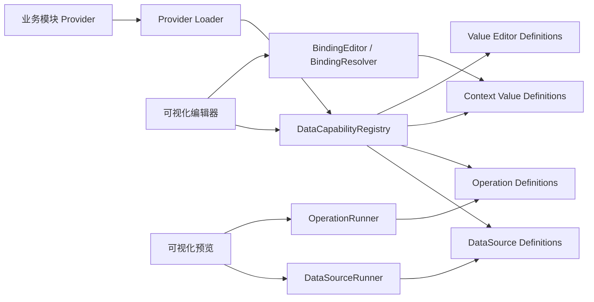

# 数据能力注册中心设计

## 1. 文档状态

- 状态：中性 API 设计已收敛，core MVP 可进入开发；全量可视化持久化迁移仍需按本文准入项确认。
- owning module：`jetlinks-web-core`。
- 首个消费者：`modules/visualization-manager-ui`。
- 能力提供方：`modules/*-ui` 中实际拥有数据或操作能力的业务模块。
- 兼容对象：已经保存、发布或作为模板流转的可视化项目 `bindCommands`。

本文定义一个面向前端业务模块的中性数据能力层。它不把设备、命令服务、可视化编辑器、智能体或具体业务页面作为核心概念，而是统一描述：

- 可读取、查询、轮询或订阅的数据源；
- 会产生副作用的创建、修改、删除、调用、控制和触发操作；
- UI 配置所需的 Schema、选项来源和扩展编辑器；
- 固定值、参数、上下文、节点输出和计算值之间的结构化绑定；
- 查询执行、订阅取消、请求合并、缓存与错误传播；
- 操作确认、幂等、并发、进度、审计与取消语义；
- 模块动态注册、注销、懒加载、权限过滤和版本迁移。

该设计是后续实现的稳定契约，不记录开发过程、临时扫描结果或测试日志。

## 2. 背景与当前问题

当前可视化编辑器以服务命令目录作为主要数据入口：

- `modules/visualization-manager-ui/api/view/designer.ts` 通过 `getCommandSupportsServices()` 获取后端命令目录，并通过 `executeCommand()` 执行命令。
- `modules/visualization-manager-ui/types/designer.d.ts` 将项目数据入口持久化为 `bindCommands`。
- `modules/visualization-manager-ui/stores/project.ts` 直接把 `bindCommands` 转成编辑器数据源树。
- `modules/visualization-manager-ui/utils/iotData.ts` 内置设备命令 ID 和服务 ID。
- `modules/visualization-manager-ui/utils/dashboard.ts`、`utils/event.ts` 存在设备聚合查询、写属性等运行时特例。
- `runtime/visualization-service/src/main/resources/application.yml` 维护可视化命令服务的后端准入清单。

命令机制解决了后端跨服务路由和统一暴露问题，但把下面几类原本不同的职责耦合在了一起：

1. 编辑器如何发现用户当前可用的数据和操作能力。
2. 业务模块如何提供字段选择、资源选择和专用配置 UI。
3. 一次查询、轮询和持续订阅如何统一执行与取消。
4. 多个查询如何合并、去重、缓存和处理动态依赖。
5. 设备控制、记录修改等副作用操作如何确认、审计和处理幂等。
6. 可视化项目如何保存稳定引用，并在模块升级后迁移。

这导致可视化模块逐渐知道设备服务 ID、命令 ID、设备接口和消息语义。新增业务模块也只能先把能力转换成可视化命令，或者继续在可视化模块中增加特例。

## 3. 目标

### 3.1 核心目标

1. 在 `jetlinks-web-core` 提供与业务域无关的 `DataCapabilityRegistry`。
2. 业务模块主动注册自己拥有的数据源、操作、上下文值和必要的配置扩展。
3. 可视化编辑器只消费统一目录、绑定模型和执行器，不再识别设备命令 ID 或业务接口。
4. 查询、订阅、取消、轮询、合并、去重、缓存由 `DataSourceRunner` 统一编排。
5. 创建、修改、删除、调用、控制等副作用由 `OperationRunner` 统一编排。
6. 普通取值使用结构化 `ValueBinding`，表达式只承担真正的计算。
7. 保留对已持久化 `bindCommands` 的兼容执行能力，避免破坏已有项目和模板。

### 3.2 非目标

1. 不在首期删除可视化后端命令接口或命令准入配置。
2. 不把所有后端跨服务访问改成浏览器直连。
3. 不把业务模块的专用选择器、查询逻辑或权限规则搬进 `jetlinks-web-core`。
4. 不让菜单可见性替代后端授权、资产权限或操作权限。
5. 不在注册定义中保存 Vue 组件实例、请求实例、Observable、函数闭包或敏感凭证。
6. 不用一个巨型 Registry 类同时承担注册、UI 状态、网络执行和运行时资源回收。

## 4. 核心结论

### 4.1 使用一个公共入口，但拆分内部职责

对外提供统一入口 `DataCapabilityRegistry`，内部使用共享注册内核和不同能力门面：



Registry 只负责：

- 注册、覆盖、排序、查询和注销；
- Provider 懒加载和模块生命周期；
- 定义版本、来源模块和变化通知；
- 根据运行时上下文计算“当前有效能力”。

Runner 负责：

- 创建运行时实例；
- 解析参数绑定；
- 查询、订阅、取消、轮询、缓存、合并和批处理；
- 操作准备、确认、执行、进度、结果和审计；
- 运行时资源回收。

UI 层负责：

- 展示能力目录；
- 根据 Schema 生成通用表单；
- 按需加载 Provider 的专用编辑器；
- 生成可持久化配置和 `ValueBinding`；
- 展示预览、校验、错误和风险提示。

### 4.2 数据读取与副作用操作分开建模

使用两个一等概念：

```text
DataCapability
├─ DataSource：read / query / poll / stream
└─ Operation：create / update / delete / invoke / control / trigger
```

原因：

- 查询可以安全地重试、共享、缓存和因取消订阅而终止。
- 操作通常不可缓存，重试受幂等约束，取消进度监听也不代表副作用被撤销。
- 操作需要风险、确认、审计、并发和批量部分成功等额外语义。

### 4.3 注册中心替换“可视化命令目录”，不替换服务端安全边界

可视化的新数据绑定不再以命令目录作为唯一发现入口，但执行时允许使用不同驱动：

- `client`：调用业务模块已经公开的前端 API、WebSocket 或本地计算能力。
- `server-proxy`：通过后端代理处理密钥、跨服务路由、集中审计或项目级授权。
- `legacy-command`：适配现有可视化命令目录和 `bindCommands`。

因此“走注册中心”不等于“全部绕过命令并由浏览器直连”。注册中心解决前端能力发现、配置和运行时编排；后端是否需要命令、代理或专用接口，由能力所有者和安全边界决定。

### 4.4 对初始模型的调整

不建议把契约固定成 `DataSourceRegistry.components[]`。UI 组件不是数据能力本身，也不是稳定持久化身份。更合适的对应关系是：

| 初始概念 | 建议概念 | 调整原因 |
| --- | --- | --- |
| `DataSourceRegistry.components[]` | definitions + provider loaders | 注册的是能力定义，UI 按需加载 |
| `DataSourceComponent` | `DataSourceDefinition` | Provider 可以只有 Schema，不一定需要 Vue 组件 |
| `DataSourceComponent.ui` | `definition.ui` | 通用 Schema 优先，专用 editor 只是可选扩展 |
| `DataSourceComponent.create()` | `definition.create()` | 工厂创建运行时实例，定义本身保持无状态 |
| `DataSource.schema` | definition 静态 schema + instance 动态 output schema | 输出字段可能依赖查询或资源选择 |
| `DataSource.fetch()` | `DataSource.query(): Observable` | 同时覆盖一次查询、分页、轮询、订阅和取消 |

原始模型的“定义创建实例”方向是合理的，需要补上定义/实例分离、流式生命周期、操作模型和结构化绑定。

## 5. 包与公共入口

建议落点：

```text
jetlinks-web-core/src/data-capability/
├─ contracts.ts
├─ registry.ts
├─ provider-loader.ts
├─ availability.ts
├─ runtime/
│  ├─ contracts.ts
│  └─ runtime.ts
├─ binding/
│  ├─ contracts.ts
│  ├─ resolver.ts
│  └─ validation.ts
├─ source/
│  ├─ contracts.ts
│  ├─ registry.ts
│  ├─ runner.ts
│  ├─ composition.ts
│  ├─ optimizer.ts
│  ├─ flow-control.ts
│  └─ cache.ts
├─ operation/
│  ├─ contracts.ts
│  ├─ registry.ts
│  └─ runner.ts
├─ legacy-command/
│  ├─ source-adapter.ts
│  └─ operation-adapter.ts
└─ index.ts
```

公共 API 只从 `index.ts` 导出。业务模块不得深层引用内部实现文件。

建议对外入口：

```ts
interface DataCapabilityRegistry {
  readonly sources: CapabilityRegistry<DataSourceDefinition>
  readonly operations: CapabilityRegistry<OperationDefinition>
  readonly contexts: CapabilityRegistry<ContextValueDefinition>
  readonly valueEditors: CapabilityRegistry<ValueEditorDefinition>
  readonly optionSources: CapabilityRegistry<OptionSourceDefinition>

  resolveCatalog(
    context: CapabilityContext,
    query?: CapabilityQuery,
  ): Promise<ResolvedCapabilityCatalog>
  onChange(listener: () => void): () => void
  createRuntime(context: RuntimeCreateContext): DataCapabilityRuntime
}
```

`CapabilityRegistry<T>` 是内部共享的泛型注册内核。数据源和操作使用不同门面、不同 Runner 和不同策略，避免通过一个联合类型把所有执行逻辑混在一起。`createRuntime()` 只是创建运行时门面，Registry 本身仍不直接执行请求。

### 5.1 Runtime 公共契约

Runtime 以项目、页面、预览实例或其它业务会话作为生命周期作用域。core 不直接认识可视化 `ComponentSchema`，组件由可视化适配层转换成带稳定 `consumerId` 的连接请求。

```ts
interface RuntimeCreateContext extends CapabilityContext {
  runtimeId: string
  isolationKey?: string
}

interface DataCapabilityRuntime {
  connect<T>(request: DataConnectionRequest): DataConnection<T>

  query<T>(
    binding: PersistedDataBinding,
    options?: RuntimeQueryOptions,
  ): Promise<DataSourceResult<T>>

  preview<T = unknown>(
    request: CapabilityPreviewRequest,
  ): Promise<CapabilityPreviewResult<T>>

  prepareOperation(
    binding: PersistedOperationBinding,
  ): Promise<PreparedOperation>

  executeOperation(
    prepared: PreparedOperation,
  ): OperationExecution

  updateParameters(values: Record<string, unknown>): void
  updateContext(providerId: string, instanceId: string, value: unknown): void
  dispose(): Promise<void>
}

interface DataConnection<T = unknown> {
  id: string
  events$: Observable<DataConnectionEvent<T>>
  data$: Observable<DataSourceResult<T>>
  refresh(): void
  pause(): void
  resume(): void
  dispose(): void
}
```

`connect()` 是数据运行平面的主入口，统一覆盖有界查询、轮询和无界流。`query()` 只是限定于单结果 `snapshot` 数据源的便捷方法，内部从同一 Observable 执行链取得首个结果并设置完成或超时条件；多批次有界流仍使用 `connect()`，不得对无界流直接使用 `lastValueFrom()`。

可视化适配概念示例：

```ts
runtime.connect({
  consumerId: `component:${component.id}:data`,
  binding: component.componentProps.dataBinding,
  mapping: component.componentProps.dataMapping,
})
```

Runtime 管理一个作用域内的绑定解析、执行共享、动态上下文、订阅和资源回收；组件只是消费者，不能成为 core 数据能力的固定类型参数。

## 6. 注册模型

### 6.1 公共定义

```ts
type CapabilityKind =
  | 'data-source'
  | 'operation'
  | 'context-value'
  | 'value-editor'
  | 'option-source'

interface CapabilityOwner {
  moduleId: string
  providerId: string
}

interface CapabilityDefinitionBase {
  id: string
  kind: CapabilityKind
  version: number
  name: string
  description?: string
  owner: CapabilityOwner
  tags?: string[]
  facets?: Record<string, unknown>
  order?: number
  availability?: CapabilityAvailabilityResolver
}
```

约束：

- `id` 是跨项目持久化的稳定标识，不能使用数组下标、路由名称或用户可见名称。
- `version` 表示持久化契约版本，不等同于模块包版本。
- `name`、`description` 的最终实现应接入当前模块 i18n，不在 core 中写死业务文案。
- Provider 注册时必须声明 `owner`，便于模块卸载、诊断和冲突处理。
- 同一 scope 下重复 `id` 默认拒绝；显式 override 通过注册 token 管理，注销后恢复上一层定义。

### 6.2 Scoped 注册和注销

注册返回注销函数：

```ts
const unregister = dataCapabilityRegistry.sources.register(definition, {
  scope: 'module:iot-ui',
})

unregister()
```

需要支持：

- 模块级常驻 Provider；
- 页面级临时覆盖；
- 微前端装载与卸载；
- 测试隔离；
- Provider 热更新后恢复旧定义；
- 注册变化通知。

可以复用 `homeAgentCapabilityRegistry` 的 token + scope + unregister 思路，但数据能力注册中心必须是独立公共契约，不能依赖智能体类型。

### 6.3 Provider 懒加载

业务模块在自己的 `register.ts` 中暴露 Provider loader manifest。core 从 `moduleRegistry` 读取 loader，而不是在 core 中用全局 `import.meta.glob('../*/...')` 扫描业务目录。

概念示例：

```ts
export default {
  dataCapabilityProviders: import.meta.glob(
    './dataCapabilities/**/provider.ts',
  ),
}
```

该方式允许：

- 业务代码按需加载；
- 模块联邦或微前端继续通过 `moduleRegistry` 暴露资源；
- loader 失败按 Provider 隔离；
- 模块卸载时执行相应注销函数。

Provider 注册不依赖当前菜单是否已经加载。菜单、按钮权限和后端状态在 `resolveCatalog(context)` 阶段动态计算。

### 6.4 Runtime 对动态注册的响应

Runtime 创建后继续监听 Registry 变化，而不是复制一份永久不变的定义快照：

- 尚未注册的持久化引用保持 `unavailable`，对应 Provider 后续注册后可以重新解析；
- Provider 注销后禁止创建新实例；
- Provider 注销、模块卸载或权限失效时，活动 DataSource 连接进入不可用状态，取消上游并执行 `dispose()`；
- 已经派发的 Operation 不因 Provider 注销而被描述成已撤销；
- 同 id 的定义替换必须经过 scope 和 version 校验，不允许用不兼容版本静默接管活动订阅；
- catalog 和 Runtime 状态变化通过可订阅事件通知可视化编辑器刷新目录及连接状态。

这使模块启动注册、页面临时注册、远程模块加载、微前端卸载和权限动态变化使用同一套生命周期语义。

## 7. DataSource 契约

### 7.1 定义与运行时实例分离

```ts
interface DataSourceDefinition extends CapabilityDefinitionBase {
  kind: 'data-source'
  configSchema?: CapabilitySchema
  querySchema?: CapabilitySchema
  outputSchema?: CapabilitySchema
  modes: Array<'snapshot' | 'page' | 'poll' | 'stream'>
  ui?: DataSourceUiDefinition
  defaults?: DataSourceRuntimeDefaults
  optimizer?: DataSourceOptimizer
  flow?: DataFlowPolicy
  create(
    config: unknown,
    context: DataSourceCreateContext,
  ): Promise<DataSource>
}

interface DataSource<T = unknown> {
  getOutputSchema?(
    query: unknown,
    context: DataSourceQueryContext,
  ): CapabilitySchema | Promise<CapabilitySchema>

  query(
    request: DataSourceRequest,
    context: DataSourceQueryContext,
  ): Observable<DataSourceResult<T>>

  dispose?(): void | Promise<void>
}

interface DataSourceResult<T = unknown> {
  data: T
  timestamp?: number
  metadata?: Record<string, unknown>
}
```

`DataSourceDefinition` 是可注册、可发现的元数据和工厂；`DataSource` 是根据项目配置创建的运行时实例。运行时实例不能进入项目持久化数据。

### 7.2 RxJS 作为统一数据运行协议

数据、状态和进度等运行时连续变化统一使用 RxJS `Observable`；注册、Schema、迁移和纯合并决策等控制平面不强制 Observable 化。

| 契约 | 推荐返回类型 | 原因 |
| --- | --- | --- |
| DataSource 查询、轮询、订阅 | `Observable` | 同时支持有界与无界数据 |
| DataConnection 状态和数据 | `Observable` | 支持重连、告警和持续结果 |
| Operation 执行进度 | `Observable` | 支持长任务和逐项结果 |
| Registry 注册、注销 | 同步函数 | 状态变更立即完成 |
| Definition 创建实例 | `Promise` | 允许一次性异步初始化 |
| Schema 解析 | 值或 `Promise` | 通常只有一个结果 |
| optimizer normalize/merge/split | 纯函数 | 需要确定、可测试且无副作用 |
| 持久化迁移 | 纯函数或受控 `Promise` | 不属于持续数据流 |

RxJS 数据协议统一表达：

- 一次性 HTTP 查询：发出一次结果后完成；
- 分页或分批查询：发出多次结果后完成；
- 实时订阅：持续发出结果，直到取消订阅或服务端完成；
- 轮询：Runner 按策略重复触发一次性查询；
- 取消：Observable teardown 关闭 WebSocket 订阅、定时器和内部资源；
- HTTP：Runner 或 Provider 同时向请求层传播 `AbortSignal`；
- 动态参数变化：通过 `switchLatest` 取消旧查询并切换到新查询。

不得用一个裸 `fetch(): Promise<T>` 同时模拟查询、订阅和取消，也不得仅删除本地回调而继续保留后端订阅。

Provider 默认返回冷 Observable：订阅时才建立请求或后端订阅，unsubscribe 时必须执行 teardown。即使底层 WebSocket 是热流，Provider 也要将监听注册和注销包装成完整 Observable 生命周期。Provider 不自行永久 `shareReplay`；是否共享由 Runtime 根据执行 key、隔离上下文和 Provider 策略决定。

Provider 的 `query()` 只发出数据结果。单次执行的终止性失败进入 RxJS `error` 通道；重试、重连和降级由 Runner 处理。Runtime 对消费者暴露结构化连接事件：

```ts
type DataConnectionStatus =
  | 'connecting'
  | 'connected'
  | 'reconnecting'
  | 'completed'
  | 'unavailable'
  | 'failed'

type DataConnectionEvent<T> =
  | {
      type: 'status'
      status: DataConnectionStatus
      error?: CapabilityError
    }
  | { type: 'data'; result: DataSourceResult<T> }
  | { type: 'warning'; error: CapabilityError }
```

可恢复的闪断和重连不能直接作为最终 `error` 终止整个连接；超过重试策略或无法恢复时才终止连接。

### 7.3 DataSourceRunner 职责

`DataSourceRunner` 负责：

1. 解析和校验配置、查询参数中的 `ValueBinding`。
2. 按 capability id 和 version 查找定义。
3. 创建、复用和销毁 `DataSource` 实例。
4. 管理订阅引用计数和 teardown。
5. 执行轮询、超时、重试、缓存和请求去重。
6. 执行跨数据源组合计划。
7. 隔离 Provider 错误并产生统一错误对象。
8. 在权限、模块或上下文变化后停止失效运行时。

Registry 不直接实现上述行为。

### 7.4 组合与合并调用

组合计划使用结构化节点，不持久化 RxJS 函数：

```ts
interface DataSourcePlan {
  version: number
  nodes: DataSourcePlanNode[]
  output: DataSourcePlanOutput
}

interface DataSourcePlanNode {
  id: string
  source: PersistedCapabilityRef
  operator?: DataSourceOperator
}

type DataSourceOperator =
  | { type: 'merge'; inputs: string[] }
  | { type: 'combineLatest'; inputs: string[] }
  | { type: 'switchLatest'; input: string }
  | { type: 'forkJoin'; inputs: string[] }
  | { type: 'bootstrapThenStream'; bootstrap: string; stream: string }
```

首期建议支持：

- `merge`：任一输入产生数据就向下游发送；
- `combineLatest`：所有输入至少产生一次后合并最新值；
- `switchLatest`：依赖参数变化时取消旧查询；
- `forkJoin`：等待多个一次性查询全部完成；
- `bootstrapThenStream`：先查询历史快照，再接续实时流；
- `poll`、`retry`、`timeout`、`map`：由白名单结构化配置描述。

表达式或自定义脚本不能直接注入 RxJS pipeline。需要扩展操作符时，通过受控的 operator definition 注册。

### 7.5 Provider 合并与 Runtime 自动共享

合并职责分为三层：

| 层级 | 职责 |
| --- | --- |
| DataSource Provider | 判断业务请求能否合并、如何合并、如何拆分结果 |
| DataCapabilityRuntime | 收集、分组、窗口调度、共享、引用计数、取消和分发 |
| 可视化组件/显式计划 | 将多个结果组合成表格行、序列、指标等消费形态 |

Runtime 不理解“设备属性”“视频通道”等业务语义，因此不能猜测不同请求是否可以合并。Provider 通过可选 optimizer 声明业务合并能力：

```ts
interface DataSourceOptimizer {
  normalize?(
    request: ResolvedDataSourceRequest,
    context: RuntimeContext,
  ): ResolvedDataSourceRequest

  getGroupKey?(
    request: ResolvedDataSourceRequest,
    context: RuntimeContext,
  ): string | undefined

  canMerge?(
    requests: ResolvedDataSourceRequest[],
    context: RuntimeContext,
  ): boolean

  merge?(
    requests: ResolvedDataSourceRequest[],
    context: RuntimeContext,
  ): MergedDataSourceRequest

  split?(
    result: DataSourceResult,
    requests: ResolvedDataSourceRequest[],
    context: RuntimeContext,
  ): ReadonlyMap<string, DataSourceResult>
}
```

执行过程：

```text
Runtime.connect(request)
→ 解析 ValueBinding
→ optimizer.normalize()
→ 计算完全相同请求的 executionKey
→ optimizer.getGroupKey() 收集兼容候选
→ 短时间窗口内调用 canMerge()
→ merge() 生成 Provider 请求
→ DataSource.query() 返回 Observable
→ 每次结果调用 split()
→ 按内部 requestId 分发给消费者
```

“合并调用”因此分为四类：

1. 数据流组合：由显式 `DataSourcePlan` 处理。
2. 完全相同请求共享：Runtime 根据 executionKey 自动共享一次上游执行。
3. 兼容请求批处理：只有 Provider 提供 optimizer 时，Runtime 才在受控窗口内合并。
4. 展示结果组合：由可视化组件的数据输入契约或显式映射处理，不参与网络请求合并。

完全相同请求的 executionKey 至少包含：

- capability id、version；
- Provider 标准化后的配置和查询；
- 执行模式、轮询和流控策略；
- 项目、租户、用户或 Provider 指定的隔离分区；
- 影响数据范围和授权结果的上下文标识。

只有 executionKey 完全相同的请求才默认共享。不同轮询周期、不同权限范围或不同错误/重试策略默认不共享；在 `merge/split` 执行器未落地前，`getGroupKey()` 只作为后续兼容批处理候选设计，不参与默认共享 key，避免把同组但字段不同的请求误合并。如需兼容合并，必须由 Provider 明确声明并由 Runtime 执行 `canMerge/merge/split`。

Provider 合并逻辑必须是确定性纯逻辑，不直接订阅、发请求或修改业务状态。Runtime 负责真正调用 `DataSource.query()`、管理 Observable 和拆分分发。

例如同一设备的两个属性查询，Provider 可以按 `deviceId` 分组，将 `temperature` 和 `humidity` 合并为一次属性集合查询，再按原始 requestId 拆回两个消费者；后端不支持多设备查询时，Provider 不能仅因字段结构相同而跨设备合并。

可视化展示组件可以声明结果组合：

```ts
interface ComponentDataContract {
  inputs: DataInputPort[]
  compose?(
    inputs: Record<string, DataSourceResult>,
    context: ComponentDataContext,
  ): unknown
}
```

该 `compose()` 只处理已经取得的数据，不管理 HTTP、WebSocket、共享、批量和取消。

缓存和共享继续由 Runtime 管理。实时流只有在 Provider 和消费方都允许时才使用 latest-value sharing（等价于 `bufferSize: 1` 的最新值回放）和引用计数；新消费者只接收最新数据/状态，不回放历史窗口。最后一个消费者取消、外部 `AbortSignal` 触发或 Runtime dispose 时，必须释放上游订阅、abort 内部信号并 dispose DataSource。

禁止：

- 跨用户、跨租户或跨项目共享缓存；
- 根据字段名相同自动 join 不同数据源；
- 在没有 Provider optimizer 时自动拼批量请求；
- 让展示组件直接控制 Provider 网络请求；
- 同时执行合并请求和原始请求，导致重复订阅或重复结果。

### 7.6 无界流与流控

RxJS 没有 Reactive Streams 的 `request(n)` 背压协议。对于高频或无界数据，Provider 和 Runtime 必须显式定义流控，不能默认无限缓存。

```ts
interface DataFlowPolicy {
  strategy:
    | 'all'
    | 'latest'
    | 'sample'
    | 'throttle'
    | 'buffer'
    | 'window'
    | 'drop'

  interval?: number
  maxBufferSize?: number
  overflow?: 'drop-oldest' | 'drop-latest' | 'error'
}
```

原则：

- Provider 声明安全默认值和允许的策略范围；
- Runtime 使用受控 RxJS operator 应用策略；
- 可视化绑定只能在 Provider 允许范围内调整；
- 实时指标和曲线可以使用 `latest`、`sample` 或 `window`；
- 业务事件可以使用有上限的 `buffer`；
- 审计、告警等不可静默丢失的数据不能依赖浏览器无限流保证可靠性，应由服务端提供可靠消费、游标或补偿查询；
- `maxBufferSize` 和 overflow 行为必须明确，禁止无界数组累积。

## 8. Operation 契约

### 8.1 中性操作模型

`Operation` 作为所有副作用能力的中性表达：

```text
Operation
├─ create
├─ update
├─ delete
├─ invoke
├─ control
└─ trigger
```

示例：

- `device.property.write`：`control`；
- `device.function.invoke`：`invoke`；
- `record.update`：`update`；
- `alarm.acknowledge`：`update` 或领域定义的 `invoke`；
- `workflow.trigger`：`trigger`。

### 8.2 定义与实例

```ts
interface OperationDefinition extends CapabilityDefinitionBase {
  kind: 'operation'
  action: 'create' | 'update' | 'delete' | 'invoke' | 'control' | 'trigger'
  configSchema?: CapabilitySchema
  inputSchema?: CapabilitySchema
  outputSchema?: CapabilitySchema
  policy: OperationPolicy
  ui?: OperationUiDefinition
  create(
    config: unknown,
    context: OperationCreateContext,
  ): Promise<Operation>
}

interface Operation {
  prepare?(
    request: OperationRequest,
    context: OperationContext,
  ): Promise<PreparedOperation>

  execute(
    prepared: PreparedOperation,
    context: OperationContext,
  ): Observable<OperationEvent>

  dispose?(): void | Promise<void>
}
```

### 8.3 操作策略

```ts
interface OperationPolicy {
  risk: 'low' | 'medium' | 'high' | 'critical'
  confirmation: 'none' | 'always' | 'destructive' | 'provider'
  idempotency: 'none' | 'natural' | 'keyed'
  cancellation: 'unsupported' | 'before-dispatch' | 'best-effort' | 'compensatable'
  retry: 'never' | 'idempotent-only' | 'provider'
  concurrency: 'parallel' | 'serial' | 'drop-while-running' | 'queue'
  batch?: boolean
  audit?: boolean
}
```

策略是 Runner 的执行约束，不只是 UI 提示。高风险操作即使在前端展示了确认框，后端仍必须执行真实授权和必要的审计。

### 8.4 两阶段执行

推荐流程：

```text
prepare
  → resolve bindings
  → validate input and targets
  → produce impact summary
  → confirm
  → execute
  → progress/result/audit
```

`prepare` 阶段不得产生目标业务副作用。它可以解析目标、进行权限预检、生成影响范围和确认摘要。

`OperationEvent` 至少能表达：

```ts
type OperationEvent =
  | { type: 'dispatching' }
  | { type: 'running'; progress?: number; message?: string }
  | { type: 'item-result'; itemId: string; success: boolean; result?: unknown; error?: CapabilityError }
  | { type: 'completed'; result?: unknown }
  | { type: 'failed'; error: CapabilityError }
  | { type: 'cancelled'; phase: 'before-dispatch' | 'after-dispatch' }
```

`OperationRunner` 返回显式执行句柄：

```ts
interface OperationExecution {
  events$: Observable<OperationEvent>
  cancel?(): Promise<OperationCancelResult>
}
```

`OperationRunner` 是 Provider `execute()` Observable 的唯一执行订阅者。调用 `executeOperation()` 在通过确认和最终校验后只启动一次操作；调用方订阅 `events$` 只是观察进度，不负责触发或维持副作用。`prepareOperation()` 产生的 canonical prepared snapshot 由 Runtime 缓存并冻结，`executeOperation()` 只能按 id 使用该快照，不能信任调用方回传的可变 request/policy。取消 `events$` 订阅只表示调用方不再监听进度。对于已经下发的设备指令、已经提交的更新或已经触发的流程，不能把 unsubscribe 描述成“操作已撤销”。只有策略和 Provider 都声明支持时，调用方才能使用显式 `cancel()`；补偿必须由显式的 compensating operation 表达。

### 8.5 操作批量与重试

- Runner 不自动把多个 Operation 合并成批量操作。
- 只有 Provider 声明 `batch: true` 且定义批量结果契约时才允许批量；`policyOverride` 只能把 `batch: true` 收紧为 `false`，不能把 Provider 的 `batch: false` 提升为 `true`。
- 批量结果必须逐目标表达成功和失败，不能只返回一个布尔值。
- `idempotency: keyed` 时由 Runner 生成或接收稳定幂等键，并传递给执行驱动。
- 只有自然幂等、带幂等键或 Provider 明确允许的操作才能自动重试。

## 9. 结构化值绑定

### 9.1 默认不使用字符串表达式取值

`${selectedDevice.id}` 的本质是对运行时上下文的引用，不是计算表达式。默认持久化为结构化绑定：

```ts
type SimpleValueBinding<T = unknown> =
  | LiteralBinding<T>
  | ParameterBinding
  | ContextBinding
  | OutputBinding

type ValueBinding<T = unknown> =
  | SimpleValueBinding<T>
  | ExpressionBinding

interface LiteralBinding<T = unknown> {
  kind: 'literal'
  value: T
}

interface ParameterBinding {
  kind: 'parameter'
  parameterId: string
  path?: DataPath
}

interface ContextBinding {
  kind: 'context'
  providerId: string
  instanceId?: string
  outputId: string
  path?: DataPath
}

interface OutputBinding {
  kind: 'output'
  nodeId: string
  port?: string
  path?: DataPath
}

interface ExpressionBinding {
  kind: 'expression'
  language: 'cel'
  expression: string
  inputs: Record<string, SimpleValueBinding>
}

type DataPath = Array<string | number>
```

对应 UI 取值方式：

| 取值方式 | 持久化类型 | 用途 |
| --- | --- | --- |
| 固定值 | `literal` | 常量、固定资源 ID、固定阈值 |
| 参数 | `parameter` | 项目参数、页面参数、公开输入参数 |
| 动态上下文 | `context` | 当前选择、事件数据、当前用户或组件公开状态 |
| 节点输出 | `output` | 上游数据源节点或转换节点的输出 |
| 高级计算 | `expression` | 条件、算术、格式化等真实计算 |

表达式的输入仍然必须显式声明为结构化绑定，不能在表达式字符串中隐藏 `${selectedDevice.id}` 这类运行时依赖。

### 9.2 上下文值由拥有者注册

```ts
interface ContextValueDefinition {
  id: string
  version: number
  name: string
  owner: CapabilityOwner
  outputSchema: CapabilitySchema
  availability?: CapabilityAvailabilityResolver
  resolve(
    reference: ContextBinding,
    context: BindingRuntimeContext,
  ): unknown | Promise<unknown> | Observable<unknown>
}
```

设备选择组件可以公开“当前选择设备”，但 core 不认识设备字段。概念示例：

```ts
{
  id: 'component.selection',
  outputSchema: {
    type: 'object',
    properties: {
      id: { type: 'string' },
      name: { type: 'string' },
    },
  },
}
```

最终绑定可以是：

```ts
{
  kind: 'context',
  providerId: 'component.selection',
  instanceId: 'device-selector-01',
  outputId: 'selection',
  path: ['id'],
}
```

### 9.3 动态选项与运行时绑定分离

必须区分：

- 动态选项：配置时下拉框中的候选设备、产品、字段来自哪里；
- 运行时绑定：执行时真正的 `deviceId` 从固定值、参数还是上下文取得。

动态选项使用 `OptionSourceDefinition` 或字段 UI Schema 描述：

```ts
interface OptionSourceDefinition extends CapabilityDefinitionBase {
  kind: 'option-source'
  querySchema?: CapabilitySchema
  optionSchema?: CapabilitySchema
  query(
    request: OptionSourceRequest,
    context: CapabilityContext,
  ): Promise<OptionSourceResult>
}

interface OptionSourceRef {
  type: 'static' | 'data-source' | 'provider'
  capabilityId?: string
  options?: CapabilityOption[]
  query?: Record<string, ValueBinding | unknown>
  labelPath?: DataPath
  valuePath?: DataPath
  childrenPath?: DataPath
  keywordParam?: string
  pagination?: boolean
}
```

选项 Provider 的输出用于编辑器展示，最终仍生成 `ValueBinding`，不能把整个 UI 选择过程或 Vue 组件保存进项目。

### 9.4 BindingResolver

`BindingResolver` 负责：

- 按 Schema 检查允许的 binding kind；
- 解析固定值、参数、上下文和节点输出；
- 检查 path 是否存在、类型是否兼容；
- 检测循环引用和悬空引用；
- 监听动态引用变化并通知 Runner 切换数据源；
- 对表达式进行语言白名单、输入白名单和执行限额控制。

## 10. UI 配置模型

### 10.1 Schema 优先，专用组件为扩展

Provider 通过 Schema 和 UI metadata 描述通用配置：

```ts
interface DataSourceUiDefinition {
  config?: CapabilityFormDefinition
  query?: CapabilityFormDefinition
  preview?: LazyComponentDefinition
}

interface OperationUiDefinition {
  config?: CapabilityFormDefinition
  input?: CapabilityFormDefinition
  confirmation?: LazyComponentDefinition
}

interface CapabilityFormDefinition {
  schema: CapabilitySchema
  uiSchema?: CapabilityUiSchema
  editor?: LazyComponentDefinition
}
```

原则：

1. 标准字符串、数字、布尔、枚举、时间、范围、引用选择优先由通用 Schema 表单生成。
2. 设备物模型、复杂资源树等通用表单无法表达的场景，Provider 才提供懒加载专用编辑器。
3. 专用编辑器代码留在 owning module，通过 loader 暴露；core 只定义 props、events 和生命周期契约。
4. 编辑器只输出可序列化配置和绑定，不持有执行实例。
5. 预览使用 Runner 执行，不能让配置组件直接维护另一套请求和订阅逻辑。

### 10.2 推荐的 UI 分层

```text
CapabilityPicker
  → CapabilityConfigPanel
    → SchemaForm / ProviderEditor
      → BindingEditor
        → LiteralEditor
        → ParameterPicker
        → ContextTreePicker
        → NodeOutputPicker
        → ExpressionEditor
  → DataPreview / OperationImpactPreview
```

`visualization-manager-ui` 负责编辑器布局、组件映射和项目保存；`jetlinks-web-core` 提供中性契约、通用绑定编辑能力和 Runner；业务 Provider 提供领域 Schema、选项与必要的专用编辑器。

## 11. 可用性、权限与安全边界

### 11.1 有效能力不是“已注册能力”的简单全集

能力有效性由以下条件共同决定：

```text
provider 已注册
∩ 模块当前可用
∩ 上下文线索允许发现或配置
∩ 当前用户菜单或按钮上下文允许展示
∩ Provider 运行时检查通过
∩ 所需后端服务可用
```

建议结果：

```ts
type CapabilityAccessPhase = 'discover' | 'configure' | 'execute'

interface CapabilityAvailability {
  discoverable: boolean
  configurable: boolean
  executable: boolean
  reason?: string
  retryable?: boolean
}
```

Provider 在模块启动时注册，不能因为用户菜单尚未加载就跳过注册。菜单加载、账号切换和权限变化后，Registry 重新计算 catalog 并通知消费者。

`discoverable`、`configurable`、`executable` 分别约束目录展示、配置保存和真实执行；菜单可见性最多作为发现阶段线索，不能代表执行授权。

### 11.2 菜单可见不等于授权

- 菜单和按钮权限用于前端能力发现、隐藏和提示。
- 后端接口、命令、代理仍必须执行真实权限和资产范围校验。
- 前端隐藏能力不能作为安全控制。
- 数据查询的租户、用户、资产隔离必须由服务端最终保证。
- 操作确认卡不能代替服务端操作权限、幂等和审计。

### 11.3 执行驱动选择

| 条件 | 推荐驱动 |
| --- | --- |
| 业务模块已有公开前端 API，后端已校验权限，调用不含服务端密钥 | `client` |
| 本地计算、浏览器状态或组件上下文 | `client` |
| 需要跨服务路由、服务端凭证、统一审计、反重放或项目发布边界 | `server-proxy` |
| 已有可视化项目持久化为 `bindCommands` | `legacy-command` |
| 高风险设备控制、批量修改、删除 | 优先 `server-proxy` 或业务后端公开操作接口 |

`client` 指由 Provider 调用业务模块正常公开的 API 封装，并不意味着绕过后端或直接访问内部服务实现。

### 11.4 敏感信息

- 不在项目配置中保存 token、密码、AccessKey 或临时签名 URL。
- 必须使用服务端 secret reference 或运行时凭证解析。
- Provider Schema 需要标记敏感字段，编辑器只保存引用或脱敏结果。
- 导出模板时必须删除项目、用户和环境相关的敏感上下文。

## 12. 持久化与版本

### 12.1 只保存稳定引用

```ts
interface PersistedCapabilityRef {
  capabilityId: string
  version: number
  config?: unknown
}

interface PersistedDataBinding {
  version: number
  source: PersistedCapabilityRef
  query?: Record<string, ValueBinding | unknown>
  mapping?: OutputMapping
  plan?: DataSourcePlan
}

interface PersistedOperationBinding {
  version: number
  operation: PersistedCapabilityRef
  input?: Record<string, ValueBinding | unknown>
  policyOverride?: Partial<OperationPolicy>
}
```

只持久化：

- `capabilityId`；
- 契约 version；
- 可序列化 config；
- query、input binding 或组合 plan。

不得持久化：

- Vue 组件、函数和闭包；
- Observable、Subscription、AbortController；
- DataSource 或 Operation 实例；
- 菜单可见性快照；
- 临时 token、签名 URL 和敏感凭证。

### 12.2 版本迁移

Provider 为自己的持久化契约负责：

```ts
interface CapabilityMigration {
  from: number
  to: number
  migrate(value: unknown): unknown
}
```

加载时按版本逐级迁移并校验。迁移失败时项目保持原始数据，不静默覆盖；编辑器显示 capability id、原版本和可恢复原因。

## 13. 旧命令兼容与迁移

### 13.1 兼容目标

当前 `bindCommands` 已经进入项目、模板、编辑器绑定、预览订阅和 AI 自动绑定流程，属于明确的持久化兼容边界，不能一次性删除。

### 13.2 适配方案

提供两个兼容 Provider：

```text
legacy.command.datasource
legacy.command.operation
```

适配器负责：

- 将命令目录中的 `forQuery`、有界查询和无界订阅映射为 DataSource definition/instance；
- 将 `forAction` 命令映射为 Operation definition/instance；
- 将现有 `bindCommands` 转成只读的持久化 capability ref 视图；
- 继续调用当前 visualization-service execute/metadata/subscribe 边界；
- 保留 `options.id` 等已有稳定实例身份；
- 保留现有项目刷新、预览和发布行为。

### 13.3 分阶段迁移

#### 阶段 A：建立 core 契约和兼容适配

- 新增 Registry、Binding、Runner 和 legacy-command adapter。
- 可视化目录同时展示新 Provider 和旧命令适配能力。
- 旧项目不改存储格式，运行时通过 adapter 执行。

#### 阶段 B：业务模块注册原生能力

- 设备、视频、告警、空间等 owning module 注册自己的 DataSource 和 Operation。
- 可视化模块删除对应的业务 ID、REST API 和运行时特例。
- 新建绑定默认保存新 capability ref。

#### 阶段 C：统一可视化持久化模型

- 项目结构增加版本化 `dataCapabilities` 或等价字段。
- 对可确定无损映射的 `bindCommands` 提供显式迁移。
- 无法映射的旧命令继续以 legacy ref 运行，不强制升级。

#### 阶段 D：收敛后端命令准入

- 统计仍在使用的 legacy command。
- 仅在没有已发布项目依赖时移除对应准入项。
- 是否最终删除 visualization command endpoint 由服务端边界和存量使用事实决定。

### 13.4 双轨期间的唯一执行原则

同一个可视化绑定只能由一个 canonical ref 执行。不能同时保留原生 capability 和 legacy command 两条活动链路，否则会产生重复请求、重复订阅或重复控制。

## 14. 生命周期

### 14.1 编辑器生命周期

```text
打开项目
→ 加载需要的 Provider
→ 解析持久化引用
→ 迁移并校验
→ 创建配置态实例
→ 预览订阅
→ 取消预览/切换组件时 unsubscribe
→ 关闭项目时 dispose
```

### 14.2 运行/预览生命周期

- 页面挂载后按当前上下文解析 binding。
- 参数或上下文变化时使用 `switchLatest` 切换依赖。
- 组件隐藏是否暂停订阅由组件策略决定，默认不等同于销毁。
- 页面卸载必须取消全部消费者订阅。
- 共享上游只有在最后一个消费者离开时才 teardown。
- Provider 被卸载、权限失效或账号切换时，Runner 终止对应实例并产生明确错误状态。

### 14.3 操作生命周期

- 操作定义按需创建，不因配置面板打开而执行。
- `prepare` 结果具有短期上下文，执行前重新校验关键目标和权限。
- 页面卸载不自动撤销已派发操作；是否继续收取进度由产品交互决定。
- 长任务恢复需要 Provider 提供 operation id 和状态查询能力，不能只依赖内存 Observable。

## 15. 错误与诊断

### 15.1 统一错误模型

```ts
interface CapabilityError {
  code: string
  stage:
    | 'load'
    | 'availability'
    | 'binding'
    | 'prepare'
    | 'execute'
    | 'subscribe'
    | 'cancel'
    | 'migrate'
  capabilityId: string
  retryable: boolean
  message?: string
  details?: Record<string, unknown>
  cause?: unknown
}
```

Provider 原始异常保留在诊断信息中，用户界面展示模块 i18n 后的可理解信息。不得因一个 Provider 加载失败而让整个能力目录不可用。

### 15.2 前端运行时诊断

建议暴露开发态只读诊断快照：

- 已注册、有效、不可用的能力数量；
- Provider 来源、版本、加载状态和最近错误；
- 活跃 DataSource 实例和消费者数量；
- 活跃订阅、轮询、缓存与批处理数量；
- Operation 当前状态和最近失败阶段；
- legacy-command 使用数量。

这是前端运行时诊断，不使用后端 MBean。Provider 的后端接口继续使用其现有日志、链路追踪和运维监控。

## 16. 完整示例

### 16.1 查询当前选择设备的属性

业务模块注册数据源：

```ts
const devicePropertySource: DataSourceDefinition = {
  id: 'device.property.latest',
  kind: 'data-source',
  version: 1,
  name: '设备属性最新值',
  owner: {
    moduleId: 'iot-ui',
    providerId: 'device-data-capabilities',
  },
  modes: ['snapshot', 'poll'],
  querySchema: {
    type: 'object',
    required: ['deviceId', 'propertyIds'],
  },
  create: async (_config, context) => context.provider.createLatestPropertySource(),
}
```

可视化保存：

```ts
{
  version: 1,
  source: {
    capabilityId: 'device.property.latest',
    version: 1,
    config: {},
  },
  query: {
    deviceId: {
      kind: 'context',
      providerId: 'component.selection',
      instanceId: 'device-selector-01',
      outputId: 'selection',
      path: ['id'],
    },
    propertyIds: {
      kind: 'literal',
      value: ['temperature'],
    },
  },
}
```

这里没有 `${selectedDevice.id}`，也没有可视化模块硬编码设备 API。

### 16.2 下发设备控制

业务模块注册 Operation：

```ts
const writeDeviceProperty: OperationDefinition = {
  id: 'device.property.write',
  kind: 'operation',
  action: 'control',
  version: 1,
  name: '设置设备属性',
  owner: {
    moduleId: 'iot-ui',
    providerId: 'device-operations',
  },
  policy: {
    risk: 'high',
    confirmation: 'always',
    idempotency: 'keyed',
    cancellation: 'before-dispatch',
    retry: 'idempotent-only',
    concurrency: 'serial',
    audit: true,
  },
  create: async (_config, context) => context.provider.createWritePropertyOperation(),
}
```

可视化事件保存：

```ts
{
  version: 1,
  operation: {
    capabilityId: 'device.property.write',
    version: 1,
    config: {},
  },
  input: {
    deviceId: {
      kind: 'context',
      providerId: 'component.selection',
      instanceId: 'device-selector-01',
      outputId: 'selection',
      path: ['id'],
    },
    propertyId: {
      kind: 'literal',
      value: 'temperature',
    },
    value: {
      kind: 'parameter',
      parameterId: 'targetTemperature',
    },
  },
}
```

可视化事件系统只调用 `OperationRunner`，不再判断 `serviceId === 'deviceService:device' && commandId === 'WriteProperty'`。

## 17. 实施计划

本设计属于跨模块、持久化契约和运行时架构调整。代码实施前需要确认本设计，确认后按以下阶段推进。

### 17.1 阶段 1：core 最小闭环

1. 实现通用 scoped registry kernel、变化通知和 Provider loader；Provider 加载缓存必须按 `isolationKey` 或租户/用户/项目等上下文隔离，避免跨租户复用 context-sensitive definitions。
2. 实现 DataCapabilityRuntime、DataSource、Operation、ValueBinding 公共类型。
3. 实现 BindingResolver、DataSourceRunner 和 OperationRunner 的最小能力。
4. 实现冷 Observable、teardown、请求共享、Provider optimizer 和有界流控基础设施；DataSource Runtime 在 `query/connect` 真正创建实例前必须以 `phase='execute'` 重查 availability，并把 `timeout/limit` 写入中性的请求约束且在 preview 层兜底裁剪。
5. 实现 legacy-command adapter，确保旧项目可运行。
6. 在 `jetlinks-web-core` 提供公共导出和单元测试。

### 17.2 阶段 2：可视化接入

1. 将数据源目录改为消费 `resolveCatalog()`。
2. 引入通用 BindingEditor 和 Provider 专用编辑器插槽。
3. 预览与事件执行统一走 Runner。
4. 仍由 adapter 读取原 `bindCommands`，不立即改项目数据结构。
5. 删除迁移范围内的重复订阅管理，但保留尚未迁移的旧路径。

### 17.3 阶段 3：首批原生 Provider

1. 选择一个只读数据源完成原生 Provider 验证。
2. 选择一个持续订阅数据源验证 teardown、重连和共享。
3. 选择一个高风险 Operation 验证准备、确认、幂等和审计。
4. 验证完成后再批量迁移设备、视频、告警等能力，避免按场景特调。

### 17.4 阶段 4：持久化收敛

1. 增加版本化 capability ref 项目结构。
2. 提供显式迁移和回退机制。
3. 统计 legacy 使用情况后决定命令目录和后端准入项的收敛范围。

## 18. 验证目标

### 18.1 Registry 与加载

- 同 scope 重复 id 被拒绝或按显式覆盖规则处理。
- 页面级覆盖注销后恢复模块级定义。
- Provider 懒加载、部分失败、重复加载和模块卸载行为正确。
- 菜单晚于模块加载时，catalog 能在菜单变化后重新计算。
- 微前端和主应用获取同一个有效注册上下文，卸载后没有残留定义。
- Runtime 创建后注册的新 Provider 能恢复此前 unavailable 的引用。
- Provider 注销后活动 DataSource 正确 teardown，已派发 Operation 不被误报为已撤销。

### 18.2 Binding

- 固定值、参数、上下文、节点输出和表达式输入可以正确解析。
- 类型不兼容、悬空 path、缺失 Provider 和循环依赖被阻止。
- `${selectedDevice.id}` 不作为普通引用的持久化格式。
- 动态选项变化不会改变已保存 binding 的语义。

### 18.3 DataSourceRunner

- 一次性查询发出一次并完成。
- Provider 默认冷 Observable 在 subscribe 时才执行，unsubscribe 时完成 teardown。
- HTTP 取消传播到 `AbortSignal`。
- 实时订阅在最后一个消费者离开时执行 teardown。
- 轮询切换、页面卸载和参数变化不会遗留定时器或 WebSocket 订阅。
- `merge`、`combineLatest`、`switchLatest`、`forkJoin`、`bootstrapThenStream` 结果符合定义。
- 完全相同请求按 executionKey 共享，权限分区或执行策略不同时不共享。
- Provider optimizer 的 normalize、group、merge、split 保持确定性，拆分结果只发送给对应消费者。
- 无 optimizer 时不同请求不被自动批处理。
- 流控策略和缓冲上限生效，overflow 行为符合定义且没有无界内存增长。
- 相同请求去重、缓存隔离、Provider 批处理和部分错误隔离正确。

### 18.4 OperationRunner

- 高风险操作未确认时不会 dispatch。
- prepare 后目标或权限变化会阻止执行。
- 非幂等操作不会自动重试。
- 取消进度监听不会伪造“副作用已撤销”。
- 只有 Provider 和策略均支持时才暴露显式 `cancel()`。
- 批量操作返回逐目标结果并处理部分成功。
- 串行、队列、并行和运行中丢弃策略符合定义。

### 18.5 兼容与安全

- 旧 `bindCommands` 项目在编辑、预览、刷新和发布后行为不回归。
- legacy adapter 与原生 Provider 不会对同一绑定重复执行。
- 无菜单能力不会出现在普通目录，但直接构造引用仍会被后端权限拒绝。
- 缓存不跨租户、用户和项目泄漏。
- 持久化与模板导出中不包含凭证、运行时对象和临时 URL。

### 18.6 工程验证

实现阶段至少执行：

```shell
pnpm -F jetlinks-web-core build
pnpm -F jetlinks-web-core test
pnpm -F jetlinks-web-core build -- --module-name visualization-manager-ui
```

并对首批 Provider 所在模块执行定向构建和实际编辑器/预览交互验证。完整工作区构建在阶段边界执行，不在每个小操作后重复运行。

## 19. 待确认决策

以下决策建议随本设计一并确认：

1. 公共名称使用 `DataCapabilityRegistry`，中文统一称“数据能力注册中心”。
2. 数据读取使用 `DataSource`，副作用使用 `Operation`。
3. 对外一个入口，内部共享 registry kernel，source/operation 使用独立 facade 和 Runner。
4. 默认使用结构化 `ValueBinding`，表达式只作为高级计算能力。
5. Provider 注册独立于菜单加载，effective catalog 再结合菜单、按钮、上下文和后端可用性过滤。
6. 新能力可以使用 `client` 驱动，但敏感或跨服务能力仍保留 `server-proxy`；旧项目使用 `legacy-command`。
7. 首期不删除 `bindCommands`，先建立无损 adapter，再迁移持久化结构。
8. UI 采用 Schema 优先、Provider 懒加载专用编辑器兜底的方式。
9. 数据运行平面统一使用 RxJS Observable；注册、Schema、迁移和纯 optimizer 保持同步或 Promise 契约。
10. 完全相同请求由 Runtime 自动共享；兼容但不相同的请求只能由 Provider optimizer 定义合并与拆分逻辑。
11. 可视化组件只负责结果映射和展示组合，不负责 Provider 网络请求合并。
12. 无界流必须声明流控和有界缓冲策略，不能依赖浏览器无限缓存。


## 20. 中性 API 详细设计补充

本节把前文设计收敛为可实施的中性 API 边界。核心原则是：`DataCapabilityRegistry` 只抽象前端数据能力本身，不认识可视化编辑器、智能体、业务页面或配置向导。具体场景通过 adapter 消费统一能力目录和运行时契约。

### 20.1 中性上下文

`CapabilityContext` 只描述能力解析和执行所需的环境线索，不描述消费者类型。

```ts
interface CapabilityContext {
  scopeId: string
  tenantId?: string
  userId?: string
  projectId?: string
  pageId?: string
  routeName?: string
  menuCode?: string
  subject?: {
    type?: string
    id?: string
    name?: string
  }
  parameters?: Record<string, unknown>
  attributes?: Record<string, unknown>
}

interface RuntimeCreateContext extends CapabilityContext {
  runtimeId: string
  isolationKey?: string
}
```

约束：

- `scopeId` 是目录解析、运行时实例、缓存和订阅的隔离边界；
- `tenantId`、`userId`、`projectId`、`pageId` 必须参与执行隔离和缓存 key；
- `routeName`、`menuCode` 只是可用性线索，不能代表授权；
- `subject` 表示当前业务主体，但 core 不解释其业务含义；
- `parameters` 承载运行时参数，`attributes` 承载宿主自定义上下文；
- Provider 可以读取这些上下文判断能力是否可见、可配置、可执行，但不能要求 core 内置消费者枚举。

### 20.2 能力目录查询与裁剪

调用方不应拿全量目录后自行拼装，应通过结构化查询让 Registry 和 Provider 一起完成裁剪。

```ts
type CapabilityKind =
  | 'data-source'
  | 'operation'
  | 'context-value'
  | 'value-editor'
  | 'option-source'

interface CapabilityQuery {
  kinds?: CapabilityKind[]
  ids?: string[]
  ownerModuleId?: string
  providerId?: string
  category?: string
  tags?: string[]
  keyword?: string
  facets?: Record<string, unknown>
  includeUnavailable?: boolean
  sourceModes?: DataSourceMode[]
  operationActions?: OperationAction[]
}

interface ResolvedCapability<T> {
  definition: T
  availability: CapabilityAvailability
}

interface ResolvedCapabilityCatalog {
  sources: Array<ResolvedCapability<DataSourceDefinition>>
  operations: Array<ResolvedCapability<OperationDefinition>>
  contexts: Array<ResolvedCapability<ContextValueDefinition>>
  valueEditors: Array<ResolvedCapability<ValueEditorDefinition>>
  optionSources: Array<ResolvedCapability<OptionSourceDefinition>>
}
```

`tags` 和 `facets` 是中性筛选元数据。例如 Provider 可以声明 `domain=device`、`realtime=true`、`risk=read`，core 只做匹配，不解释业务含义。

### 20.3 访问阶段

能力可用性必须区分发现、配置和执行三个阶段。

```ts
type CapabilityAccessPhase = 'discover' | 'configure' | 'execute'

interface CapabilityAvailability {
  discoverable: boolean
  configurable: boolean
  executable: boolean
  reason?: string
  retryable?: boolean
}
```

含义：

- `discoverable`：是否可出现在目录中；
- `configurable`：是否允许被配置、保存或迁移；
- `executable`：是否允许真实查询、订阅或执行操作。

菜单可见性最多作为 `discoverable` 的输入线索，不能代替后端权限、资产范围或操作审计。

### 20.4 Provider Source Model

Provider 是能力来源适配层，而不是能力本身。命令目录、REST API、WebSocket / Topic、本地计算、第三方数据源或业务模块私有 API 都可以通过 Provider 转成统一能力定义。

```ts
interface DataCapabilityProvider {
  id: string
  owner: CapabilityOwner
  order?: number

  load?(
    context: CapabilityContext,
  ): Promise<DataCapabilityProviderLoadedResult> | DataCapabilityProviderLoadedResult

  dispose?(): void | Promise<void>
}

interface DataCapabilityProviderLoadedResult {
  sources?: DataSourceDefinition[]
  operations?: OperationDefinition[]
  contexts?: ContextValueDefinition[]
  valueEditors?: ValueEditorDefinition[]
  optionSources?: OptionSourceDefinition[]
}
```

推荐注册常驻 Provider，在 `resolveCatalog(context)` 时动态加载或生成当前上下文有效 definitions；不推荐应用启动时永久注册所有命令或远程能力，避免 pageType、projectId、权限、用户切换或后端状态变化导致能力目录污染。

### 20.5 CapabilitySchema 与配置 UI

首期采用 JSON Schema 风格的受控子集，统一服务配置表单、参数校验、绑定编辑、输出映射和 adapter 投影。

```ts
interface CapabilitySchema {
  type:
    | 'object'
    | 'array'
    | 'string'
    | 'number'
    | 'integer'
    | 'boolean'
    | 'null'
  title?: string
  description?: string
  required?: string[]
  properties?: Record<string, CapabilitySchema>
  items?: CapabilitySchema
  enum?: unknown[]
  const?: unknown
  default?: unknown
  format?: string
  sensitive?: boolean
  readOnly?: boolean
  bindable?: boolean
  binding?: FieldBindingPolicy
  optionSource?: OptionSourceRef
}

interface FieldBindingPolicy {
  allowedKinds?: ValueBinding['kind'][]
  required?: boolean
  sensitive?: boolean
}

interface CapabilityUiSchema {
  widget?: string
  placeholder?: string
  help?: string
  order?: string[]
  hidden?: boolean
  disabled?: boolean
  props?: Record<string, unknown>
}
```

Schema 描述数据和校验规则；`uiSchema` 只描述展示 hint。复杂资源选择器、字段树、模型选择等通过 Provider 暴露 lazy editor，但 editor 只能输出可序列化 `config`、`query`、`input` 或 `ValueBinding`，不能把 Vue 组件实例、函数、请求实例或运行时对象保存到项目数据中。

### 20.6 动态选项 OptionSource

配置 UI 中常见的设备、产品、字段、通道、空间树、模板等候选项应抽象为中性 OptionSource，而不是每个编辑器重复写请求逻辑。

```ts
interface OptionSourceDefinition extends CapabilityDefinitionBase {
  kind: 'option-source'
  querySchema?: CapabilitySchema
  optionSchema?: CapabilitySchema
  query(
    request: OptionSourceRequest,
    context: CapabilityContext,
  ): Promise<OptionSourceResult>
}

interface OptionSourceRef {
  type: 'static' | 'data-source' | 'provider'
  capabilityId?: string
  options?: CapabilityOption[]
  query?: Record<string, ValueBinding | unknown>
  labelPath?: DataPath
  valuePath?: DataPath
  childrenPath?: DataPath
  keywordParam?: string
  pagination?: boolean
}

interface CapabilityOption {
  label: string
  value: unknown
  disabled?: boolean
  children?: CapabilityOption[]
  metadata?: Record<string, unknown>
}
```

OptionSource 只是候选值来源，不表达业务含义。最终保存的仍然是 `ValueBinding`、`config`、`query` 或 `input`。

### 20.7 OutputMapping 与结果投影

数据源输出和调用方输入之间通过中性 `OutputMapping` 连接。可视化现有的 `mapping`、`mappingFormat`、`DATA_RESPONSE_VIRTUAL_VAR` 属于 adapter 兼容格式，应逐步转换到该模型。

```ts
interface OutputMapping {
  version: number
  fields: Record<string, OutputMappingValue>
  format?: Record<string, OutputFormatRule>
}

type OutputMappingValue =
  | DataPathMapping
  | ValueBinding
  | NestedOutputMapping

interface DataPathMapping {
  kind: 'path'
  path: DataPath
  defaultValue?: unknown
}

interface NestedOutputMapping {
  kind: 'object'
  fields: Record<string, OutputMappingValue>
}

interface OutputFormatRule {
  type: 'raw' | 'string' | 'number' | 'date' | 'boolean' | 'array' | 'object'
  format?: string
  timezone?: string
  fallback?: unknown
}
```

投影规则：

- DataSource 负责声明 `outputSchema`；
- 使用方或 adapter 负责声明目标输入 schema；
- `OutputMapping` 只保存可序列化 path、binding 和 format；
- MappingProjector 可以校验 path 是否存在、默认值是否满足目标类型、格式化是否安全；
- core 不认识组件类型，也不根据组件名猜测 rows、series 或 scalar。

### 20.8 Preview / Dry Run

配置态预览必须与真实副作用执行分离。

```ts
interface CapabilityPreviewRequest {
  binding: PersistedDataBinding
  sampleContext?: Record<string, unknown>
  timeout?: number
  limit?: number
}

interface CapabilityPreviewResult<T = unknown> {
  data?: T
  outputSchema?: CapabilitySchema
  warnings?: CapabilityError[]
  diagnostics?: Record<string, unknown>
}
```

规则：

- 查询类预览可以真实执行，但必须设置 timeout、limit 和结果裁剪；
- 操作类预览只允许调用 `prepare`，不得直接产生业务副作用；
- 高风险 Operation 必须在 `prepare` 返回影响摘要后，由宿主按中性 policy 决定确认交互；
- 预览诊断信息必须脱敏，不包含 token、签名 URL、完整请求头或敏感 payload。

### 20.9 命令动态适配为能力

命令可以动态注册为数据能力，但命令不是 core 的一等概念。`legacy-command` Provider 负责在 `resolveCatalog(context)` 阶段读取命令目录，并按命令语义生成中性的 DataSource 或 Operation。

```ts
interface LegacyCommandProviderOptions {
  providerId: string
  moduleId: string

  listCommands(
    context: CapabilityContext,
  ): Promise<LegacyCommandCatalog>

  getMetadata?(
    command: LegacyCommandRef,
    context: CapabilityContext,
  ): Promise<LegacyCommandMetadata>

  execute(
    command: LegacyCommandRef,
    input: unknown,
    context: LegacyCommandExecuteContext,
  ): Promise<unknown>

  subscribe?(
    command: LegacyCommandRef,
    input: unknown,
    context: LegacyCommandExecuteContext,
  ): Observable<unknown>
}

interface LegacyCommandRef {
  serviceId: string
  commandId: string
  commandName?: string
  groupName?: string
}
```

映射规则：

- `forQuery`、read、snapshot、poll、subscribe 类命令映射为 `DataSourceDefinition`；
- `forAction`、write、invoke、control、trigger 类命令映射为 `OperationDefinition`；
- 同一个命令如果同时具备查询和副作用语义，可以生成两个不同 capability id；
- capability id 由 adapter 稳定生成，例如 `legacy.command.datasource.<serviceId>.<commandId>` 和 `legacy.command.operation.<serviceId>.<commandId>`；
- `serviceId`、`commandId` 只保存在 legacy adapter 的 metadata / facets 中，不进入 core 基础字段；
- pageType、projectId、用户、权限、后端服务状态变化后必须重新 resolve catalog，不永久缓存旧命令 definitions。

### 20.10 可视化现有绑定模型迁移

当前可视化绑定由项目级 `bindCommands`、组件级 `dataSourceProps`、事件级 `eventProps.actionData` 和运行态 `preview.ts` 共同完成。迁移时按 adapter 分层处理，不把这些可视化专属字段放入 core。

映射关系：

| 当前可视化模型 | 中性模型 | 迁移方式 |
| --- | --- | --- |
| `bindCommands` 命令目录与实例 | `PersistedDataBinding` / `PersistedOperationBinding` | legacy adapter 首期运行时转换，后续无损迁移再写新结构 |
| `dataSourceProps.sourceId/sourceDetail` | `PersistedCapabilityRef.capabilityId/config` | 使用 `options.id` 或 adapter 生成的稳定 id，避免依赖目录下标 |
| `dataSourceProps.inputs` | `query` / `input` + `ValueBinding` | 固定值转 literal，动态值转 parameter/context/output |
| `mapping + mappingFormat` | `OutputMapping` | adapter 兼容旧格式，逐步保存新格式 |
| `eventProps.actionData` | `PersistedOperationBinding` | actionData 转 Operation，确认/风险/并发交给 OperationPolicy |
| `preview.ts` 手写订阅与分发 | `DataCapabilityRuntime.connect()` | Runtime 管理订阅、轮询、teardown、共享和错误 |

推荐阶段：

1. core 先实现中性 registry、schema、binding、mapping、runtime 和 legacy-command provider skeleton；
2. 可视化运行态先从旧结构转换出中性 binding，再调用 `runtime.connect()`，不立即改保存结构；
3. 数据源配置面板从 `projectStore.datasourceTreeData` 切到 `resolveCatalog(context)`；
4. 新建绑定保存 `dataCapabilities`、`dataBindings`、`operationBindings`，旧字段继续兼容；
5. 只对可确定无损映射的旧项目做显式迁移，无法无损映射的继续走 legacy adapter。

### 20.11 智能体等其他场景的 adapter 边界

智能体、页面、配置向导等场景不得反向污染 core。它们可以基于 `ResolvedCapabilityCatalog` 和 `DataCapabilityRuntime` 构造自己的 adapter，例如把只读 DataSource 投影为工具、把低风险 Operation 投影为需要确认的工具，或把 CapabilitySchema 投影为表单。但 core 不导入这些场景的类型。adapter 必须遵守：

- DataSource 投影默认为只读；
- Operation 默认不自动投影为可执行工具，除非 adapter 显式允许；
- 高风险 Operation 必须走 `prepare` 和确认；
- 工具或页面返回结果必须执行 result guard 和敏感字段裁剪；
- adapter 只能消费中性 API，不能要求 Provider 针对某个消费者写分支。

### 20.12 首期 MVP 与暂缓项

首期必须实现：

1. `CapabilityDefinitionBase`、`DataSourceDefinition`、`OperationDefinition`；
2. `CapabilitySchema`、`CapabilityUiSchema`、`OptionSourceRef`；
3. `ValueBinding`、`OutputMapping`；
4. scoped `DataCapabilityRegistry` 和 `resolveCatalog(context, query)`；
5. `DataCapabilityRuntime` 的 `query`、`connect`、`preview`、`prepareOperation`、`executeOperation` 最小闭环；
6. HTTP AbortSignal、Observable teardown、poll timer 清理和 runtime dispose；
7. legacy-command provider skeleton；
8. 数据能力测试页路由，用于目录查看、配置预览、查询验证和操作 dry-run / execute 验证；
9. registry、binding、mapping、source runner、operation runner 的单元测试。

首期暂缓：

- CEL 表达式执行；
- 复杂 optimizer merge / split；
- 跨 Provider 编排图；
- 长任务恢复；
- 完整低代码表单渲染器；
- 全量旧项目持久化迁移。


### 20.13 开发准入判断

按当前文档，可以开始进入 **core MVP 开发**，但不建议直接开始全量可视化持久化迁移。准入边界如下：

可立即开发：

- `jetlinks-web-core` 内中性类型、Registry kernel、Provider loader、Catalog resolver；
- `CapabilitySchema` / `CapabilityUiSchema`、`ValueBinding`、`OutputMapping` 的纯工具能力；
- DataSource / Operation runner 的最小闭环、取消、teardown、dispose、错误模型；
- legacy-command provider skeleton，以及从旧命令到中性 definition / binding 的运行时转换；
- 数据能力测试页路由，作为 core 能力的人工验收入口；
- 以上能力的单元测试和最小导出。

进入可视化接入前需要先锁定：

- `moduleRegistry` 暴露 dataCapability provider loader 的 manifest 字段名和装载时机；
- 可视化 adapter 对旧 `bindCommands`、`dataSourceProps`、`eventProps.actionData` 的无损转换规则；
- 新旧持久化字段共存策略，尤其是保存、模板导出、发布后的回读优先级；
- 首批验证 Provider 的选择，建议先选一个只读查询、一个订阅、一个高风险操作；
- 配置 UI 首期只做通用 Schema 表单 + lazy editor 插槽，不先做完整低代码表单渲染器。

不建议首期开发：

- 把 core 写成面向可视化、智能体或页面的消费者专用 API；
- 在 core 类型里引入 `serviceId`、`commandId`、`bindCommands`、组件 id、AI tool 等场景字段；
- 一次性迁移所有旧项目持久化结构；
- 在 Runtime 中按设备、图表、组件类型猜测请求合并或输出映射。

因此，开发起点应是 `jetlinks-web-core` 的中性 API 和 runtime 基础设施；可视化只作为首个 adapter 验证方接入，不作为 core 模型来源。


### 20.14 数据能力测试页路由

为避免首期只能通过可视化编辑器间接验证能力，`jetlinks-web-core` 应提供一个隐藏的测试页面路由，作为数据能力注册、配置、查询、预览和操作执行的人工验收入口。该页面是 **diagnostics / lab adapter**，只能消费中性 API，不能把测试页字段反向写入 core 契约。

推荐路由：

```ts
const DATA_CAPABILITY_LAB_ROUTE: RouteRecordRaw = {
  path: '/data-capability/lab',
  name: 'DataCapabilityLab',
  component: () => import('@jetlinks-web-core/views/data-capability/lab/index.vue'),
  meta: {
    title: '数据能力测试',
    hideInMenu: true,
    skipMenuFetch: true,
  },
}
```

路由约束：

- 默认隐藏在菜单中，只作为开发、验收和故障诊断入口；
- 需要登录态，不作为 public route；
- `skipMenuFetch` 只表示不依赖菜单树展示，不代表绕过能力执行权限；
- 生产环境若开放入口，必须叠加显式权限、环境开关或调试开关；
- 页面不得保存项目数据、模板数据或消费者专属配置，只保存当前会话内的测试草稿。

页面目标：

1. 展示当前 `CapabilityContext` 下 `resolveCatalog(context, query)` 返回的能力目录；
2. 支持按 kind、provider、owner module、tag、facet、关键字、可用性阶段过滤；
3. 展示 capability id、version、owner、modes / action、schema、uiSchema、policy、availability、diagnostics；
4. 根据 `CapabilitySchema` 生成 config、query、input 的测试表单，也允许切到 JSON 编辑；
5. 支持 DataSource 的 `preview()`、`query()`、`connect()` 测试；
6. 支持 Operation 的 `prepareOperation()` 和受控 `executeOperation()` 测试；
7. 展示运行事件、数据结果、错误、warning、teardown 状态和执行耗时；
8. 支持导出当前测试 request JSON，便于补单元测试 fixture。

建议首屏结构：

```text
┌──────────────────────────────────────────────────────────────┐
│ Context / Catalog Query                                      │
│ scopeId tenant project page subject keyword kind provider... │
├───────────────┬───────────────────────────────┬──────────────┤
│ Capability    │ Definition / Schema / Policy  │ Test Runner  │
│ List          │                               │              │
│ - source      │ id/version/owner              │ config       │
│ - operation   │ schema/uiSchema/output        │ query/input  │
│ - option      │ availability/diagnostics      │ preview/run  │
├───────────────┴───────────────────────────────┴──────────────┤
│ Events / Result / Warnings / Export Fixture                  │
└──────────────────────────────────────────────────────────────┘
```

运行能力：

| 能力类型 | 测试动作 | 约束 |
| --- | --- | --- |
| DataSource snapshot | `preview()` / `query()` | 强制 timeout、limit、AbortSignal |
| DataSource page | `query()` | 展示分页参数、返回总数和当前页 |
| DataSource poll | `connect()` | 可设置 poll interval，离开页面必须 teardown timer |
| DataSource stream | `connect()` | 显示连接状态、事件数、缓冲上限和 unsubscribe |
| OptionSource | `query()` | 支持 keyword 和分页，展示 label/value/path 映射 |
| Operation low risk | `prepareOperation()` + 可选 `executeOperation()` | execute 需要二次确认 |
| Operation high / critical risk | 默认只允许 `prepareOperation()` | execute 需要显式开启危险操作测试开关 |

测试页状态模型：

```ts
interface DataCapabilityLabState {
  context: CapabilityContext
  query: CapabilityQuery
  selectedCapabilityId?: string
  selectedKind?: CapabilityKind
  draftConfig?: unknown
  draftQuery?: Record<string, ValueBinding | unknown>
  draftInput?: Record<string, ValueBinding | unknown>
  connection?: DataConnection
  events: DataConnectionEvent[]
  result?: unknown
  warnings: CapabilityError[]
  diagnostics: Record<string, unknown>
}
```

安全与副作用边界：

- 测试页不提供批量自动执行 Operation；
- Operation 默认先 `prepare`，页面展示影响摘要、risk、confirmation、idempotency 和 audit 策略；
- `high` / `critical` 操作在测试页中禁止真实执行；如需验证只能通过业务模块自己的受控入口或专用联调环境；
- 所有结果展示必须执行敏感字段脱敏，`sensitive` schema 字段默认隐藏；
- 离开页面、切换 capability、切换 context 时必须主动 `unsubscribe` / `dispose`；
- 导出的 fixture 不包含 token、签名 URL、完整请求头、用户隐私或运行时对象。

开发顺序：

1. core 类型、Registry、Runtime 最小闭环完成后再实现测试页；
2. 测试页先支持 catalog + DataSource preview/query；
3. 再补 OptionSource 和 stream/poll connect；
4. 最后补 Operation prepare，并将真实 execute 作为受控开关；
5. 可视化 adapter 接入前，使用该页面验证 legacy-command provider 和首批原生 Provider。

### 20.15 当前实现与验证结果

本轮已进入 core MVP 开发，并完成首个隐藏测试页入口。当前实现落点：

- `src/data-capability/`：中性类型、Registry、BindingResolver、Runtime、OutputMapping、legacy-command provider adapter；
- `src/types/module.ts`：`moduleRegistry` 资源类型新增 `dataCapabilityProviders`；
- `src/router/basic.ts`、`src/router/coreRoutes.ts`、`src/views/data-capability/lab/`：隐藏路由 `/data-capability/lab` 默认只在开发环境或显式 `VITE_DATA_CAPABILITY_LAB=true` 时注册，用于目录查看、注册 UI 组件预览、JSON 草稿配置、DataSource preview/query/connect、OptionSource query、Operation prepare/execute 验证；
- 可视化 legacy-command provider、legacy binding adapter 与 `tests/unit/dataCapability*.spec.ts` 位于 `cloud.jetlinks.ui` / `visualization-manager-ui` 集成 PR 中，不作为本 core PR 的文件落点；
- 集成侧测试覆盖 catalog、provider 注册/卸载、多 Provider 同 scope 隔离、参数绑定、query、connect 共享与 teardown、operation prepare、operation 单次执行共享、execute 前 availability 复查、policyOverride 收紧、ExpressionBinding unsupported、legacy-command 映射与 legacy binding 转换。

本轮验证结果：

```bash
pnpm -C ui exec esbuild tests/unit/dataCapabilityCore.spec.ts --bundle --platform=node --format=esm --target=node22 --outfile=/tmp/dataCapabilityCore.mjs --external:vue --external:ant-design-vue --external:@jetlinks-web/vite --external:@jetlinks-web-core/utils/consts --external:@jetlinks-web-core/utils/module-registry && node /tmp/dataCapabilityCore.mjs

pnpm -C ui exec esbuild tests/unit/dataCapabilityLegacy.spec.ts --bundle --platform=node --format=esm --target=node22 --outfile=/tmp/dataCapabilityLegacy.mjs --external:vue --external:ant-design-vue --external:@jetlinks-web/vite --external:@jetlinks-web-core/utils/consts --external:@jetlinks-web-core/utils/module-registry && node /tmp/dataCapabilityLegacy.mjs

pnpm -C ui exec vue-tsc -p jetlinks-web-core/tsconfig.json --noEmit 2>&1 | rg "data-capability|DataCapability|legacyCapability|legacyCommandProvider|visualization-manager-ui/register.ts|WorkbenchHome|dataCapabilityCore|dataCapabilityLegacy" || true

pnpm -C ui -F jetlinks-web-core build -- --module-name visualization-manager-ui

pnpm -C ui -F jetlinks-web-core build
```

结论：

- core MVP 已可构建；可视化 legacy provider 构建结果由 `visualization-manager-ui` / `cloud.jetlinks.ui` 集成 PR 承载；
- `/data-capability/lab` 默认不会进入生产核心路由；仅开发环境或显式 `VITE_DATA_CAPABILITY_LAB=true` 时可作为人工验收入口。选择带 `ui.preview`、表单 `editor` 或 `value-editor.editor` 的能力时，会加载注册组件并注入当前 capability、context、草稿 config/query/input、运行 result/events；
- 全量 `vue-tsc` 仍存在仓库既有类型噪声，本轮以新增能力相关关键字过滤确认未引入相关类型错误；
- 构建输出仍有既有 CSS `//` 注释、chunk 过大、动态/静态重复导入等 warning，本轮未扩大处理；
- 手动运行页面仍需要真实后端、登录态和 provider 数据，需在联调环境访问 `/data-capability/lab` 完成人工验证。


评审修复补充：

- Provider 注册改为每次注册生成唯一 token，注册项、scope 和注销函数按 token 精确绑定，避免同 scope 多 Provider 或同 Provider 多 scope 相互覆盖；
- Runtime connect 会按标准化请求生成 executionKey，共享完全相同请求，并在最后一个消费者取消时取消上游 subscription、abort signal 并 dispose DataSource；
- Operation execute 会在 Runtime 内部只订阅一次 Provider Observable，并用 ReplaySubject 共享同一次执行事件，避免多观察者重复触发副作用；
- `policyOverride` 只能收紧策略：risk / confirmation 取更严格值，retry / cancellation 取更保守值，audit 只能开启不能关闭；
- execute 前按 `phase='execute'` 重新检查 availability，避免配置后上下文变化导致越权执行；
- `updateContext()` 写入的结构化上下文会进入 RuntimeContext.contexts，供 ContextValue provider 使用；
- ExpressionBinding 在 CEL 解释器接入前明确抛出 `expression.unsupported`，配置 UI 不应开放表达式类型；
- 测试页禁止执行 `high` / `critical` Operation，且路由默认不在生产核心路由中注册。

## 21. 外部实践参考

- [React Admin DataProvider 类型与 AbortSignal](https://github.com/marmelab/react-admin/blob/7ee7217e6f6f758b3091d9ce2ff880fad4ffb666/packages/ra-core/src/types.ts)
- [React Admin 多 DataProvider 路由](https://github.com/marmelab/react-admin/blob/7ee7217e6f6f758b3091d9ce2ff880fad4ffb666/packages/ra-core/src/dataProvider/combineDataProviders.ts)
- [Refine DataProvider 契约](https://github.com/refinedev/refine/blob/779d52a20e29b0307ac0df04d135beba434370dc/packages/core/src/contexts/data/types.ts)
- [NocoBase DataSourceManager](https://github.com/nocobase/nocobase/blob/05f33b6595bdb9042bff6fa0075c00a5e7567f40/packages/core/client/src/data-source/data-source/DataSourceManager.ts)
- [NocoBase Flow Engine DataSource](https://github.com/nocobase/nocobase/blob/05f33b6595bdb9042bff6fa0075c00a5e7567f40/packages/core/flow-engine/src/data-source/index.ts)
- [RxJS Observable teardown 契约](https://github.com/ReactiveX/rxjs/blob/c15b37f81ba5f5abea8c872b0189a70b150df4cb/packages/observable/src/types.ts)
- [TanStack Query cancellation](https://tanstack.com/query/v5/docs/framework/react/guides/query-cancellation)
- [Appsmith Plugin UI metadata](https://github.com/appsmithorg/appsmith/blob/098e53694ee104fa3d7e38f78898d6b69bf0145e/app/client/src/entities/Plugin/index.ts)

这些实践共同支持本设计中的几项选择：Provider/Manager 与实例分离、前端直接 DataProvider、取消信号、观察者生命周期、Provider 路由，以及 UI metadata 与执行边界分离。
